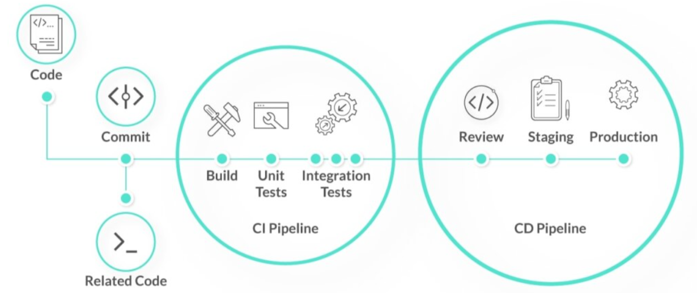

# Continuous Integration and Continuous Delivery 🏗️☁️

<p align="center">
  
</p>

<br>

## 📌 Why CI/CD Exists 

CI/CD exists to **automate building, testing, and deploying code** so releases are fast, safe, and stress-free.

Before CI/CD:

* Manual deployments 😰
* Bugs in production
* Slow releases (weeks/months)

After CI/CD:

* Automated pipeline
* Faster feedback
* Reliable releases

---

## Core Concepts 

| Term                        | Simple Meaning                             |
| --------------------------- | ------------------------------------------ |
| CI (Continuous Integration) | Auto build + test code on every push       |
| CD (Continuous Delivery)    | Auto deploy to staging/testing environment |
| Continuous Deployment       | Auto deploy directly to production         |

---

# 🔁 Continuous Integration (CI)

### What happens?

Developers push code → Pipeline automatically:

1. Builds the app
2. Runs unit tests
3. Detects bugs early


**Goal** <br>
Catch errors before they reach production.

**Key Idea** <br>
Small code changes + frequent commits = fewer bugs.

---

# 🚚 Continuous Delivery (CD)

### What happens?

After CI succeeds:

* App is deployed to staging/QA environment
* Integration & acceptance tests run

**Goal** <br>
Always keep the application **release-ready**.

**Important:** <br>
Production deployment may still need manual approval.

---

# ⚡ Continuous Deployment 

### What happens?

If all tests pass →
Code is **automatically deployed to production** (no manual approval).

Used by companies like:

* Netflix
* Amazon
* Facebook

Because they trust automation + strong testing.

---

# ⚖️ CI vs CD vs Continuous Deployment 

| Feature          | CI         | CD                 | Continuous Deployment |
| ---------------- | ---------- | ------------------ | --------------------- |
| Build automation | ✅          | ✅                  | ✅                     |
| Testing          | Unit tests | Unit + Integration | Full test suite       |
| Deployment       | ❌          | To staging         | To production         |
| Manual approval  | Yes        | Optional           | No                    |

---

# 🧱 CI/CD Pipeline 

```
Code → Build → Test → Package → Deploy → Test → Release
```

<p align="center">
  
</p>


Think of it like a factory assembly line 🏭
Each stage checks quality before moving forward.

---

# 🔗 Simple Pipeline Stages 

### 1. Source Code

* Developer writes code (Python, Java, etc.)
* Pushes to Git repository

### 2. CI Tool Trigger

Examples:

* Jenkins
* GitHub Actions
* GitLab CI

Pipeline starts automatically after `git push`.

### 3. Build Stage

* Compile code
* Create artifact (JAR, Docker image, etc.)

### 4. Unit Testing

* Tests individual functions
* If tests fail → pipeline stops ❌

### 5. Artifact Storage

* Store build output in:

  * Docker Registry
  * Nexus
  * Artifactory
  * AWS ECR

**Key Rule:** <br>
Build once, deploy the same artifact everywhere.

### 6. Deployment (Staging/QA)

* Deploy app to test environment
* Run integration tests

### 7. Production Deployment

If all tests pass:

* Same artifact
* Same deployment process
* Only configs change (secrets, URLs)

---

# 🧪 Testing Strategy in CI/CD 

| Test Type         | When                        | Purpose                    |
| ----------------- | --------------------------- | -------------------------- |
| Unit Tests        | During build                | Check code logic           |
| Integration Tests | After deployment to staging | Check service interactions |
| E2E Tests         | Before production           | Check real user flow       |

---

# 🌟 Key Benefits 

### 1. Faster Releases

Minutes instead of weeks.

### 2. Early Bug Detection

Bugs caught during CI, not in production.

### 3. Less Stressful Deployments

No “big release day” panic.

### 4. Better Team Productivity

Automation > Manual work.

### 5. Safer Deployments

Small, tested changes reduce risk.
