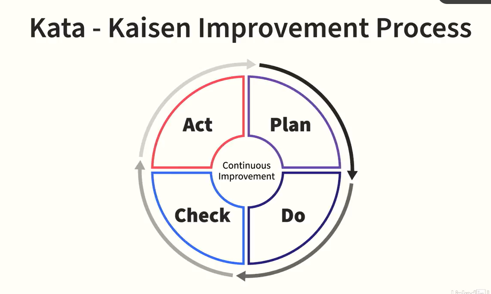
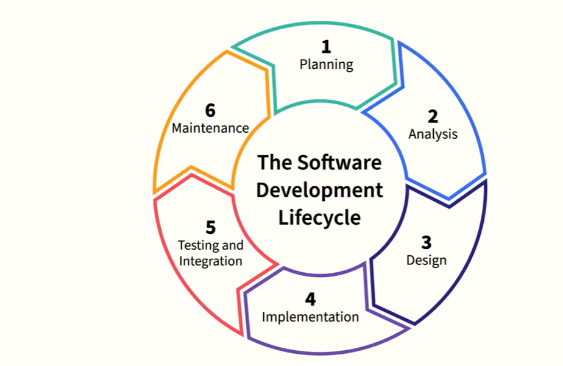
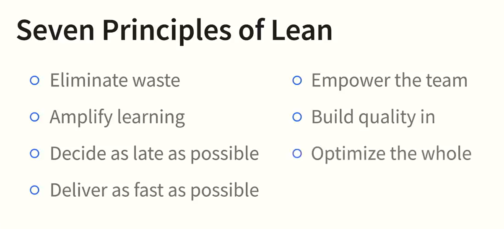

<h1 align="center">Chapter 1. DevOps Basics</h1>
<br>

<h2 align="center">What is DevOps?</h2>

**DevOps = Dev + Ops working together** across the entire lifecycle (design → deploy → operate).

Earlier:
- Dev wrote code  
- Ops ran it  
- Result → silos, delays, blame  

DevOps fixes this by focusing on **collaboration, shared ownership, and flow**.

**Flow:**  
Values → Principles → Practices → Tools

---

<h2 align="center"> DevOps Values – CAMS </h2>

<p align="center">
  
</p>


**CAMS = Culture, Automation, Measurement, Sharing**

- **Culture** → Break silos, shared responsibility  
- **Automation** → Reduce manual work (after culture)  
- **Measurement** → Measure outcomes, not vanity metrics  
- **Sharing** → Knowledge, transparency, learning  

**Key idea:** Change behavior first, tools later.

---

<h2 align="center"> DevOps principles: The Three Ways </h2>

<p align="center">
  
</p>

Created by **Gene Kim & Mike Orzen**

1. **Systems Thinking & Flow**  
   - Optimize the whole system  
   - Value exists only when software reaches customers  

2. **Feedback Loops**  
   - Fast feedback = early fixes = less waste  

3. **Continuous Learning**  
   - Experiment, fail fast, improve continuously  

---

<h2 align="center">The Five Practices of DevOps</h2>

<p align="center">
  
</p>

1. **Culture** → Trust, safety, collaboration  
2. **Process** → Agile + Lean  
3. **IaC** → Infrastructure managed by code  
4. **Continuous Delivery (CD)** → Small, frequent releases  
5. **SRE** → Engineering reliability  

> All five must grow together.

---

<h2 align="center">DevOps Tool Guidance</h2>

```
People → Process → Tools
```
- Tools must support collaboration  
- Keep tools **simple and integrated**  
- Must work in **dynamic environments** (cloud, containers)

**More tools ≠ better DevOps**


---
---


<h1 align="center">Chapter 2. DevOps and People: A Culture Change</h1>
<br>

DevOps is mainly a **culture change**, not a tooling change.

<h2 align="center">The Three Cs</h2>

- **Communication** → Clear, intentional info flow  
- **Collaboration** → Shared ownership, no handoffs  
- **Continuous Learning** → Learn from failure, no blame  

---

<h2 align="center">Communication and Trust Power DevOps</h2>
- Poor communication breaks DevOps  

- Transparency builds **trust**  

- High-trust ( **generative** ) teams focus on mission  

**One line:**  
Communication → Trust → DevOps

---

<h2 align="center">Collaboration: Breaking Silos in DevOps</h2>

### Why silos exist
- Dev → speed  
- Ops → stability  
- Result → **Wall of Confusion**

> Problem is **incentives**, not people skills.

### Conway’s Law
> Systems mirror communication structure.

### What works
- Cross-functional teams  
- Shared goals & metrics  
- Self-service automation  

**Renaming a team “DevOps” fixes nothing.**

---

<h2 align="center">Kaizen – Continuous Improvement</h2>

**Kaizen (Japanese)** = continuous improvement

Key ideas:
- **Know the customer**
- **Enable flow**
- **Go to gemba** (gemba = real place where value is created)
- **Empower people**
- **Transparency**

<p align="center">
  
</p>


---
---


<h1 align="center">Chapter 3. DevOps and Process: The Building Blocks</h1>
<br>

Three core process blocks:
1. **Agile**
2. **Lean**
3. **Visible Ops Change Control**

---

<h2 align="center"> 1. Agile</h2>

Agile = small iterations + fast feedback.

- Build → test → learn → repeat  
- Frequent working software  
- Strong collaboration  

<p align="center"> 
   
</p>

<h3 align='center'>Teamwork... - Makes the dream work.</h3>

> Agile lacked Ops → DevOps extends Agile to services.

---

<h2 align="center"> 2. Lean </h2>

Lean = remove waste, improve flow.

**Japanese waste types:**
- **Muda** → no value work  
- **Mura** → uneven flow  
- **Muri** → overburden  

<p align="center"> 
   
</p>

<p align="center"> 
   
</p>

**Lean tools:**
- Value stream mapping  
- Kanban (visual work)  
- Limit WIP  

<p align="center"> 
   
</p>

> In short, Lean says: “Stop wasting time and energy. Make the value flow smoothly and continuously.”

---

<h2 align="center">3. Visible Ops Change Control</h2>

Most outages happen due to **change**.

Visible Ops = **lightweight change control**

- Small changes  
- Peer review  
- Escalate only risky changes  
- Test early (CI, automation)

**Goal:** Safety without slowing delivery.

Agile → speed & feedback <br>
Lean → remove waste <br>
Visible Ops → safe change <br>

Together = fast, stable DevOps

---
---

<h1 align="center">Chapter 4. Infrastructure as Code (IaC)</h1>
<br>

## Infrastructure as Code (IaC)

**IaC** = managing **servers, networks, storage, platforms** using **code**, not manual work.

- Old: manual setup → slow, inconsistent, error-prone  
- IaC: declarative code → automated, repeatable infra  
- Enabled by **cloud, APIs, virtualization**

> IaC works best when **Dev + Ops collaborate**.

---

## What IaC Covers (DevOps Scope)

IaC applies to:
- **Provisioning** → create infra (servers, network)
- **Deployment** → install apps
- **Orchestration** → coordinate changes at scale

This is part of **Configuration Management (CM)** → keep systems in desired state.

---

## Key IaC Concepts (Must Remember)

- **Imperative** → how to do it  
- **Declarative** → what you want  
- **Idempotent** → same result every run  
- **Drift** → real system ≠ code  
- **Self-service** → teams trigger automation

---

## Evolution of IaC (Short Timeline)

### 1. Cloud Era (2010s)
- Infra created from code (AWS, Azure)
- **Model-driven provisioning**
- Example: **AWS CloudFormation** (templates)

### 2. IaC Tools Rise
- **Terraform, Pulumi** → multi-cloud DSL
- **AWS CDK, boto** → pure code approach
- Trade-off: power vs idempotency

### 3. Containers Change Everything
- Apps packaged with runtime (**Docker**)
- Less OS configuration needed
- Faster dev + fewer runtime bugs

### 4. Immutable Infrastructure
- Servers/images **never change**
- Replace instead of modify
- Used by Netflix, cloud giants
- Reduces drift by design

### 5. Orchestration Platforms (2020s)
- **Kubernetes, Mesos** → provisioning + deploy + orchestration
- **Serverless / PaaS** → “give code, platform handles rest”

---

## Golden Image → Foil Ball → Immutable

- **Golden images** → image sprawl
- Runtime CM → config drift (**foil ball**)
- **Immutable infra** → rebuild, don’t patch
- Containers = smallest immutable unit

---

## IaC Toolchain (DevOps Rule)

> **You don’t pick tools. You design a toolchain.**

### Toolchain Decisions
- Managed platform vs self-managed infra  
- Template-based (CloudFormation, ARM)  
- DSL tools (**Terraform, Pulumi**)  
- Pure code (**CDK, boto, Bicep**)  

### Configuration & Baking
- Runtime CM: **Chef, Puppet, CFEngine**
- Orchestration CM: **Ansible, Salt**
- Image baking: **Packer**
- Containers: **Dockerfiles**

> **Baking moves risk earlier**, less flexibility in prod.

### Orchestration Options
- CM-based (Ansible, Salt)
- Platform-based (Kubernetes)
- Runbook tools (**Rundeck**)

---

## Testing (Non-negotiable)

> If you’re not testing, you’re not really coding.

- Unit test IaC
- Integration test infra
- CI pipeline for **code + infra + runbooks**

---

## Big Picture

```
IaC + Containers + Orchestration
= Fast, scalable, repeatable DevOps
```

**Infrastructure moved from pets → cattle → code.**
