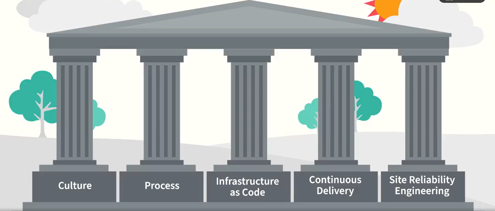

<h1 align="center">What is DevOps?</h1>

DevOps is a combination of two traditional roles in tech: **Development (Dev)** and **Operations (Ops)** to improve how software is built, deployed, and maintained.

Earlier, developers and operations engineers worked in silos. Developers focused on building applications, while operations teams were responsible for deploying, maintaining, and supporting them in production. This separation often caused delays, miscommunication, and deployment issues.

In the late 2000s, the concept of **DevOps** emerged to bridge this gap.

DevOps is a **practice and culture** where development and operations teams work together throughout the **entire service lifecycle** — from design and development to deployment, monitoring, and production support. It covers both **application-level** and **system-level** responsibilities.


### DevOps consists of Values -> Principles -> Practices -> Tools


---


<h1 align="center"> DevOps Values – CAMS </h1>

<p align="center">
  
</p>


**CAMS** is a DevOps values model created by **John Willis** and **Damon Edwards**.  
It stands for **Culture, Automation, Measurement, and Sharing**.

### C – Culture
DevOps is primarily a **people problem**, not a technology problem.  
Earlier, development and operations teams worked in silos with conflicting goals, which caused friction and poor outcomes.  
DevOps culture focuses on **collaboration, shared responsibility, and mutual understanding** to improve overall business results.

### A – Automation
Automation helps remove manual work, reduce errors, and increase speed.  
However, automation alone is **not DevOps**.  
Once the right culture is in place, automation acts as an **accelerator** for building, deploying, and managing systems efficiently.

### M – Measurement
Measurement helps teams understand what is actually happening in systems and processes.  
DevOps emphasizes measuring **meaningful outcomes**, such as deployment frequency, recovery time, cost, and customer or employee satisfaction, instead of tracking the wrong or misleading metrics.

### S – Sharing
Sharing promotes collaboration and continuous learning.  
This includes sharing knowledge, ideas, metrics, and problems through documentation, reviews, mentoring, and open communication.  
Transparency makes teams stronger and improves both technical and business outcomes.

**In short:**  
CAMS reminds us that DevOps is about **changing behavior**, using **automation to move faster**, **measuring to improve**, and **sharing to build better services together**.


---


<h1 align="center"> DevOps principles: The Three Ways </h1>

<p align="center">
  
</p>

The **Three Ways of DevOps** are guiding principles created by **Gene Kim** and **Mike Orzen**.  
They explain how to turn DevOps values (CAMS) into real, working practices.

### 1. The First Way – Systems Thinking & Flow
Focus on the **entire system**, not individual teams or components.

Optimizing one part of the system in isolation can hurt overall performance.  
DevOps emphasizes improving the **end-to-end flow** of work — from idea to customer — by reducing silos, handoffs, and bottlenecks.

👉 Value is created only when software reaches the customer successfully.

### 2. The Second Way – Amplifying Feedback Loops
Create **fast and continuous feedback** between teams and systems.

The sooner problems are detected, the cheaper and easier they are to fix.  
Short feedback loops (tests, monitoring, reviews) improve quality, speed, and reliability across development and operations.

👉 Faster feedback = better decisions and less waste.

### 3. The Third Way – Continuous Experimentation & Learning
Encourage a culture of **learning by doing**.

Teams should experiment, fail fast, learn from mistakes, and continuously improve.  
This principle promotes innovation, skill growth, and constant refinement of processes and tools.

👉 Repeated practice and experimentation lead to mastery.

**In summary:**  
The Three Ways guide DevOps teams to **optimize the whole system**, **learn quickly through feedback**, and **continuously improve through experimentation**.


---


<h1 align="center">The Five Practices of DevOps</h1>

<p align="center">
  
</p>

Unlike Agile, DevOps does not follow a single prescriptive framework.  
Instead, common patterns have emerged that form a **DevOps practice playbook** built on **five key practice areas**.

### 1. Culture
Create a safe and stable environment where people can **collaborate, learn, experiment, and even fail**.  
Culture is the foundation of DevOps and focuses on people, trust, and shared responsibility.

### 2. Process
Adopt **Agile and Lean** practices to improve how work flows.
Key practices include:
- Small batch sizes  
- Limiting work in progress  
- Fast feedback loops  
- Lightweight change approvals  

These processes align with the **Three Ways of DevOps** and directly impact business success.

### 3. Infrastructure as Code (IaC)
Manage infrastructure using **code instead of manual actions**.
By using cloud services, containers, and programmable infrastructure, teams gain:
- Reproducibility  
- Self-service  
- Faster scaling and recovery  

### 4. Continuous Delivery (CD)
Automate testing and deployment to release **small, frequent changes**.
Continuous Delivery improves:
- Speed  
- Quality  
- Reliability  
- Team confidence  

It is one of the most impactful DevOps practices.

### 5. Site Reliability Engineering (SRE)
Apply an engineering approach to **reliability and operations**.
SRE focuses on:
- Building reliability into systems  
- Observability and monitoring  
- Automation in operations  

### Key Takeaway
These five practice areas **must evolve together**.  
Focusing on one while ignoring others leads to poor results and instability.

**DevOps maturity comes from balancing and iterating across all five pillars.**


---


<h1 align="center">DevOps Tool Guidance</h1>

DevOps is **not tool-first**.  

A core DevOps principle is:

```
People → Process → Tools
```
This means:
1. Identify the people responsible and support them properly  
2. Define clear and effective processes  
3. Only then choose tools that best fit those needs  

There is **no single “best” DevOps tool** — only the best tool for your specific organization and use case.

### Key Principles for Choosing DevOps Tools

#### 1. People Over Process Over Tools <br>
Tools should improve **collaboration and sharing**, not just individual productivity.  
The best tools are those that **everyone in the value stream can use effectively**.

#### 2. Keep It Simple (KISS Principle) <br>
Every tool adds complexity:
- Learning
- Maintenance
- Security
- Integration

Using too many tools slows teams down.   <br>
More tools ≠ better DevOps.

👉 Simple, well-integrated tools beat large, complex tool stacks.

#### 3. Build a Toolchain, Not Isolated Tools
DevOps tools must **integrate well** with each other.
Build pipelines where:
- Build tools
- Deployment tools
- Observability tools
- Infrastructure tools  

work together as a **single toolchain**.

Good tools are composable, like Linux commands that can be chained together.

#### 4. Support Dynamic Environments
Modern systems are dynamic (cloud, containers, auto-scaling).
Tools must:
- Adapt automatically
- Expose APIs
- Avoid manual configuration like fixed IPs

Static tools break in modern DevOps environments.

### Final Takeaway
Choose tools that:
- Fit your people and processes  
- Promote collaboration and sharing  
- Stay simple  
- Integrate easily  
- Adapt to change  

**DevOps success comes from how tools are used — not how many you use.**
