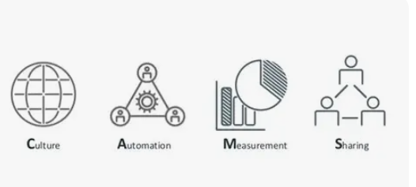
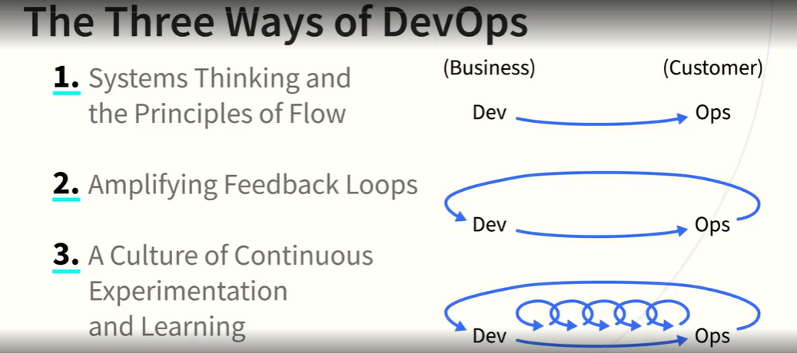
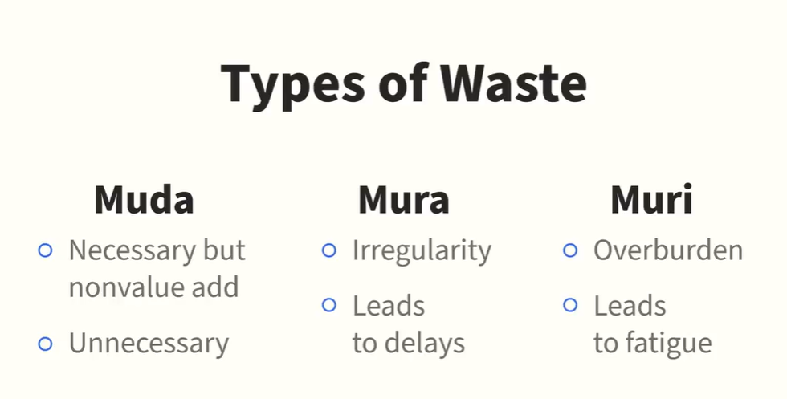
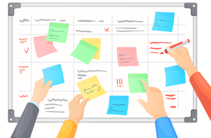
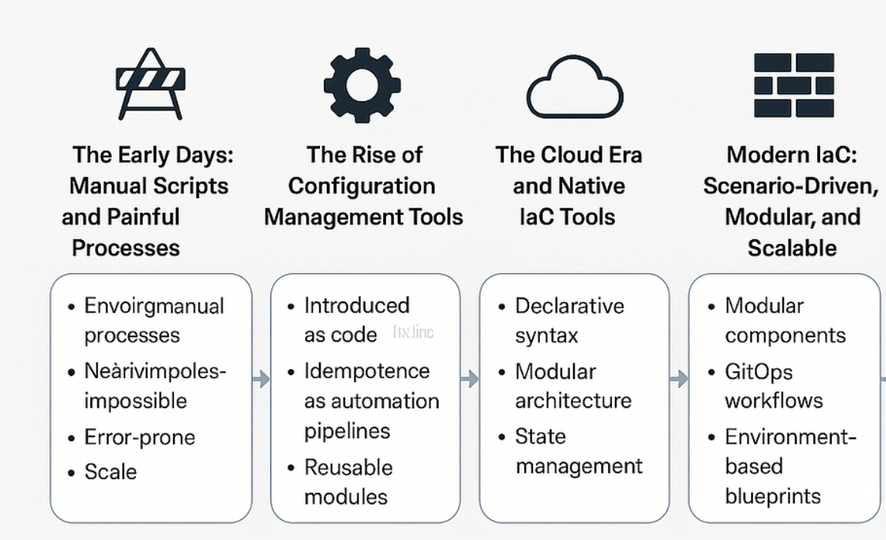
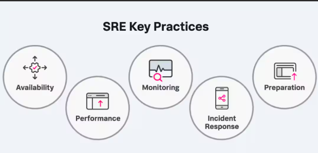

<h1 align='center'>Devops Foundation</h1>

---
<br><br>

<h1 align="center">Chapter 1. DevOps Basics</h1>
<br>

<h2 align="center">What is DevOps?</h2>

**DevOps = Dev + Ops working together** across the entire lifecycle (design → deploy → operate).

Earlier:
- Dev wrote code  
- Ops ran it  
- Result → silos, delays, blame  

DevOps fixes this by focusing on **collaboration, shared ownership, and flow**.

**Flow:**  
Values → Principles → Practices → Tools

---

<h2 align="center"> DevOps Values – CAMS </h2>

<p align="center">
  
</p>


**CAMS = Culture, Automation, Measurement, Sharing**

- **Culture** → Break silos, shared responsibility  
- **Automation** → Reduce manual work (after culture)  
- **Measurement** → Measure outcomes, not vanity metrics  
- **Sharing** → Knowledge, transparency, learning  

**Key idea:** Change behavior first, tools later.

---

<h2 align="center"> DevOps principles: The Three Ways </h2>

<p align="center">
  
</p>

Created by **Gene Kim & Mike Orzen**

1. **Systems Thinking & Flow**  
   - Optimize the whole system  
   - Value exists only when software reaches customers  

2. **Feedback Loops**  
   - Fast feedback = early fixes = less waste  

3. **Continuous Learning**  
   - Experiment, fail fast, improve continuously  

---

<h2 align="center">The Five Practices of DevOps</h2>


1. **Culture** → Trust, safety, collaboration  
2. **Process** → Agile + Lean  
3. **IaC** → Infrastructure managed by code  
4. **Continuous Delivery (CD)** → Small, frequent releases  
5. **SRE** → Engineering reliability  

> All five must grow together.

---

<h2 align="center">DevOps Tool Guidance</h2>

```
People → Process → Tools
```
- Tools must support collaboration  
- Keep tools **simple and integrated**  
- Must work in **dynamic environments** (cloud, containers)

**More tools ≠ better DevOps**


---
---


<h1 align="center">Chapter 2. DevOps and People: A Culture Change</h1>
<br>

DevOps is mainly a **culture change**, not a tooling change.

<h2 align="center">The Three Cs</h2>

- **Communication** → Clear, intentional info flow  
- **Collaboration** → Shared ownership, no handoffs  
- **Continuous Learning** → Learn from failure, no blame  

---

<h2 align="center">Communication and Trust Power DevOps</h2>
- Poor communication breaks DevOps  

- Transparency builds **trust**  

- High-trust ( **generative** ) teams focus on mission  

**One line:**  
Communication → Trust → DevOps

---

<h2 align="center">Collaboration: Breaking Silos in DevOps</h2>

### Why silos exist
- Dev → speed  
- Ops → stability  
- Result → **Wall of Confusion**

> Problem is **incentives**, not people skills.

### Conway’s Law
> Systems mirror communication structure.

### What works
- Cross-functional teams  
- Shared goals & metrics  
- Self-service automation  

**Renaming a team “DevOps” fixes nothing.**

---

<h2 align="center">Kaizen – Continuous Improvement</h2>

**Kaizen (Japanese)** = continuous improvement

Key ideas:
- **Know the customer**
- **Enable flow**
- **Go to gemba** (gemba = real place where value is created)
- **Empower people**
- **Transparency**


---
---


<h1 align="center">Chapter 3. DevOps and Process: The Building Blocks</h1>
<br>

Three core process blocks:
1. **Agile**
2. **Lean**
3. **Visible Ops Change Control**

---

<h2 align="center"> 1. Agile</h2>

Agile = small iterations + fast feedback.

- Build → test → learn → repeat  
- Frequent working software  
- Strong collaboration  (Teamwork... - Makes the dream work.)

> Agile lacked Ops → DevOps extends Agile to services.

---

<h2 align="center"> 2. Lean </h2>

Lean = remove waste, improve flow.

**Japanese waste types:**
- **Muda** → no value work  
- **Mura** → uneven flow  
- **Muri** → overburden  

<p align="center"> 
   
</p>

**Lean tools:**
- Value stream mapping  
- Kanban (visual work)  
- Limit WIP  

<p align="center"> 
   
</p>

> In short, Lean says: “Stop wasting time and energy. Make the value flow smoothly and continuously.”

---

<h2 align="center">3. Visible Ops Change Control</h2>

Most outages happen due to **change**.

Visible Ops = **lightweight change control**

- Small changes  
- Peer review  
- Escalate only risky changes  
- Test early (CI, automation)

**Goal:** Safety without slowing delivery.

Agile → speed & feedback <br>
Lean → remove waste <br>
Visible Ops → safe change <br>

Together = fast, stable DevOps


---
---


<h1 align="center">Chapter 4. Infrastructure as Code (IaC)</h1>
<br>

<h2 align="center"> Infrastructure as Code (IaC) </h2>

**IaC** = managing **servers, networks, storage, platforms** using **code**, not manual work.

- Old: manual setup → slow, inconsistent, error-prone  
- IaC: declarative code → automated, repeatable infra  
- Enabled by **cloud, APIs, virtualization**

> IaC works best when **Dev + Ops collaborate**.

---

## What IaC Covers (DevOps Scope)

IaC applies to:
- **Provisioning** → create infra (servers, network)
- **Deployment** → install apps
- **Orchestration** → coordinate changes at scale

This is part of **Configuration Management (CM)** → keep systems in desired state.

---

## Key IaC Concepts (Must Remember)
 
- **Declarative** → say what you want, not how
- **Idempotent** → run again, nothing breaks 
- **Drift** → real system changing away from code (bad) 
- **Self-service** → teams don’t wait on ops tickets

---

<h2 align="center"> Evolution of IaC </h2>

### 1. Cloud Era (2010s)
- Infra created from code (AWS, Azure)
- **Model-driven provisioning**
- Example: **AWS CloudFormation** (templates)

### 2. IaC Tools Rise
- **Terraform, Pulumi** → multi-cloud DSL
- **AWS CDK, boto** → pure code approach
- Trade-off: power vs idempotency

### 3. Containers Change Everything
- Apps packaged with runtime (**Docker**)
- Less OS configuration needed
- Faster dev + fewer “works on my machine” bugs

### 4. Immutable Infrastructure
- Servers/images **never change**
- Replace instead of modify
- Used by Netflix, cloud giants
- Less drift, more stability

### 5. Orchestration Platforms (2020s)
- **Kubernetes, Mesos** → provisioning + deploy + orchestration
- **Serverless / PaaS** → “give code, platform handles rest”


<p align="center"> 
   
</p>

> IaC turned infrastructure from manual work → code → containers → platforms that run everything for you.

---

## Golden Image → Foil Ball → Immutable

- **Golden images** → image sprawl
- Runtime CM → config drift (**foil ball**)
- **Immutable infra** → rebuild, don’t patch
- Containers = smallest immutable unit

---

## IaC Toolchain (DevOps Rule)(this is the mindset shift)

> **You don’t pick tools. You design a toolchain.**

### Toolchain Decisions
- Managed platform vs self-managed infra  
- Template-based (CloudFormation, ARM)  
- DSL tools (**Terraform, Pulumi**)  
- Pure code (**CDK, boto, Bicep**)  

### Configuration & Baking
- Runtime CM: **Chef, Puppet, CFEngine**
- Orchestration CM: **Ansible, Salt**
- Image baking: **Packer**
- Containers: **Dockerfiles**

> **Baking moves risk earlier**, less flexibility in prod.

### Orchestration Options (making things work together)
- CM-based (Ansible, Salt)
- Platform-based (Kubernetes)
- Runbook tools (**Rundeck**)

---

## Testing (Non-negotiable)

> If you’re not testing, you’re not really coding.

- Unit test IaC
- Integration test infra
- CI pipeline for **code + infra + runbooks**

---

## Big Picture

```
IaC creates infra
Containers package apps
Orchestration coordinates everything
```


---
---


<h1 align="center">Chapter 5. Continuous Integration (CI)and Continuous Delivery (CD)</h1>
<br>

<h2 align="center"> Continuous Integration (CI) </h2>
- Automatically **build & test** code on every commit to keep the application in a working state. 
- **Six practices:**  
  1. Builds run fast (<5 min)  
  2. Commit small changes  
  3. Don’t leave broken builds  
  4. Trunk-based development  
  5. Fix flaky tests  
  6. Build → status + log + artifact  

<h2 align="center"> Continuous Delivery (CD) </h2>
- Deploy every change to **production-like environment**  
- Automate integration, acceptance tests  
- Use **immutable artifacts** → trust + auditability  
- Stop pipeline if failure occurs  

### Continuous Deployment
- Auto-release to production after tests pass  
- Deployment patterns:  
  - Rolling  
  - Blue-Green  
  - Canary  
  - A/B / feature flags  

### QA in DevOps
- Automated testing essential for CI/CD  
- Types of tests:  
  - **Unit** → function-level  
  - **Code hygiene** → linters, formatters  
  - **Integration** → all components  
  - **Acceptance / End-to-End** → user perspective  
- TDD (Test Driven Development) & BDD (Behavior Driven Development) – write tests before code. 

### CI/CD Toolchain Layers
1. **Deployment:** containers, system images, feature flags, orchestration  
2. **Artifact repository:** Artifactory, Nexus, private repos  
3. **Testing tools:** PyTest, Selenium, cypress, InSpec, JMeter, Dependabot  
4. **Build system:** Jenkins, GitHub Actions  


<p align="center"> 
   
</p>


---
---


<h1 align="center">Chapter 6. Site Reliability Engineering</h1>
<br>

<h2 align="center"> What is SRE </h2>
- Site Reliability Engineering (SRE) is about making systems reliable—keeping them up, fast, secure, and working correctly.
- It combines operations and engineering, so you not only run systems but also improve and automate them.  
- The main idea is to design reliability from the start, rather than trying to patch problems later.
- Benefits include fewer failed changes, faster recovery from issues, and meeting uptime and performance goals.

## Building for Reliability
- Reliability starts when you design the system, not after it’s live. There are patterns and tools that help:  
- Key patterns: 
  - **Circuit Breaker**: stops failures from spreading when one part of the system fails.
  - **Timeouts**: avoid waiting indefinitely for a slow component..  
- Tools/libraries: 
  - **Resilience4j**: provide ready-made patterns for stability.
  - 12-Factor App principles: Follow principles like these to make applications easier to deploy and maintain.
- Reality: systems fail → build **resilience**--
  - Redundancy: multiple copies of servers/services.
  - Load balancing & auto-scaling: handle varying traffic automatically.
  - Automatic failover & recovery: keep services running even when parts fail. 
- Developers on-call: "You write it, you run it."

## Observability
- Observability is knowing how your system is doing by looking at outputs like metrics, logs, and user experience 
- Key areas: 
    - synthetic checks: automated tests simulating user actions
    - metrics:CPU, memory, custom app metrics.
    - user performance: real user monitoring (RUM) and application performance monitoring (APM).
    - logs: for debugging, auditing, and analysis.
    - security monitoring: detect attacks or suspicious behavior..  
- Collaboration between devs, PMs, and ops is crucial.

## Incident Response & Postmortems
- Expect failures; focus on **troubleshooting, automation, communication**.  
  - Troubleshooting: find and fix the issue.
  - Automation: speed up safe fixes.
  - Communication: keep stakeholders informed.
- Postmortems: **learn, don’t blame**; fix system and process gaps.  

## SRE Toolchain
- **Reliability tools:** Resilience4j, 12-Factor apps.  
- **Observability:** Datadog, Prometheus, Grafana.  
- **Incident management:** PagerDuty, OpsGenie, Rundeck.  
- Principle: **keep it simple, iterate based on real feedback**.


<p align="center"> 
   
</p>


---

<br><br>

[Click here to redirect to INDEX](../README.md) 