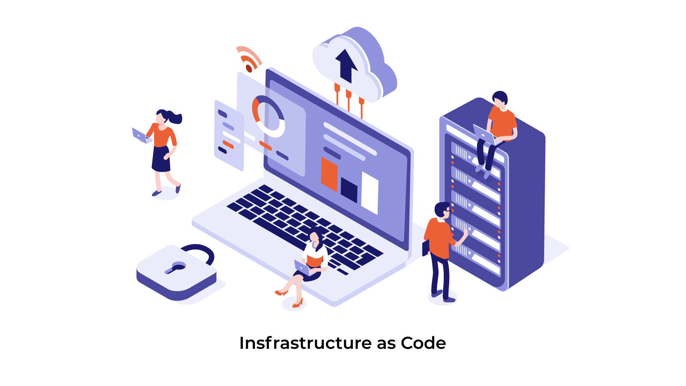
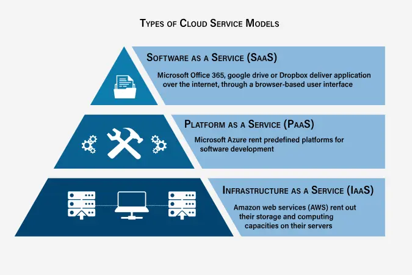
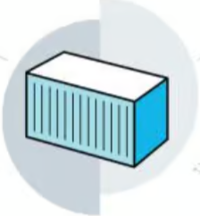
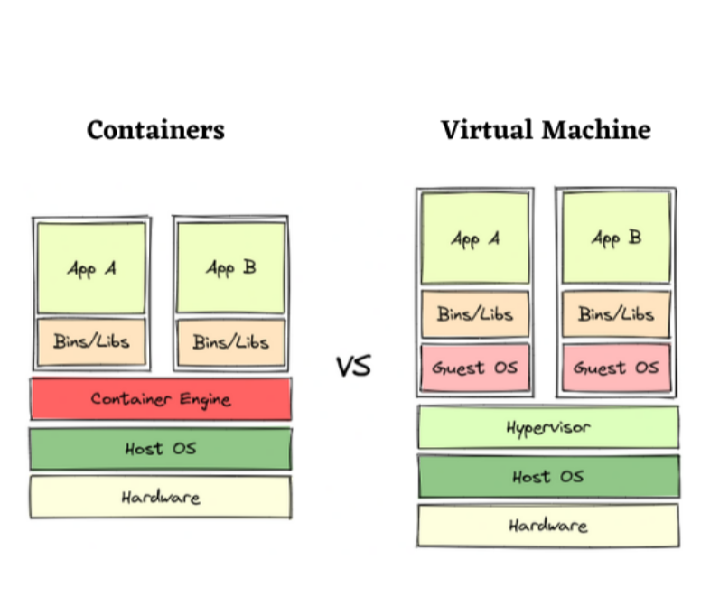
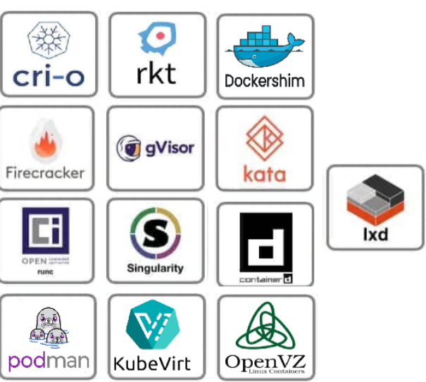
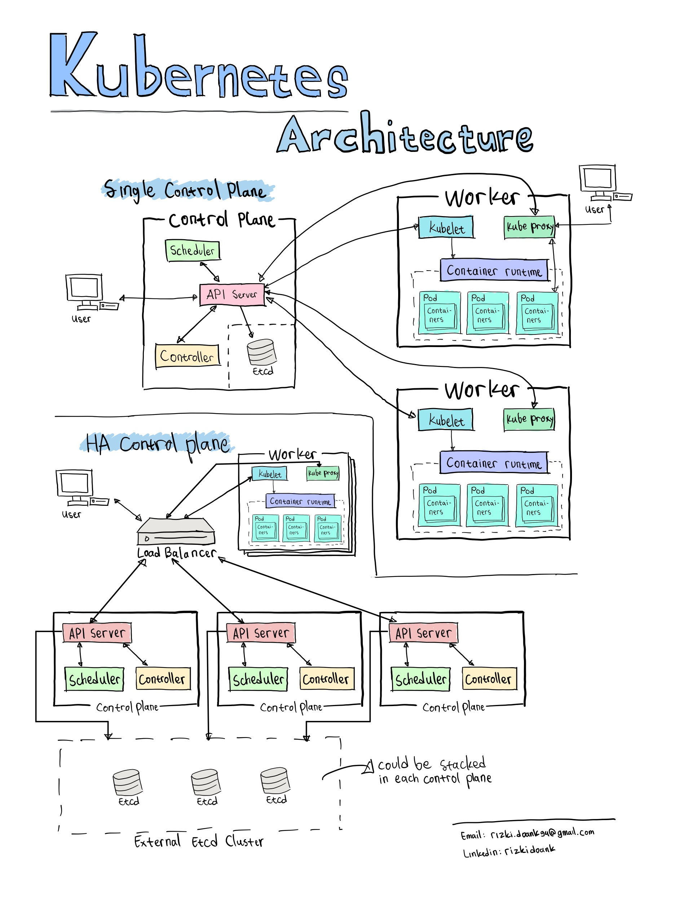
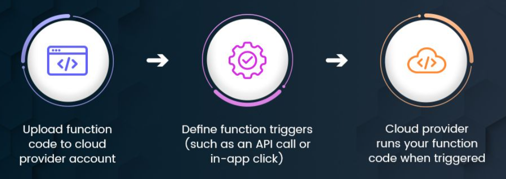
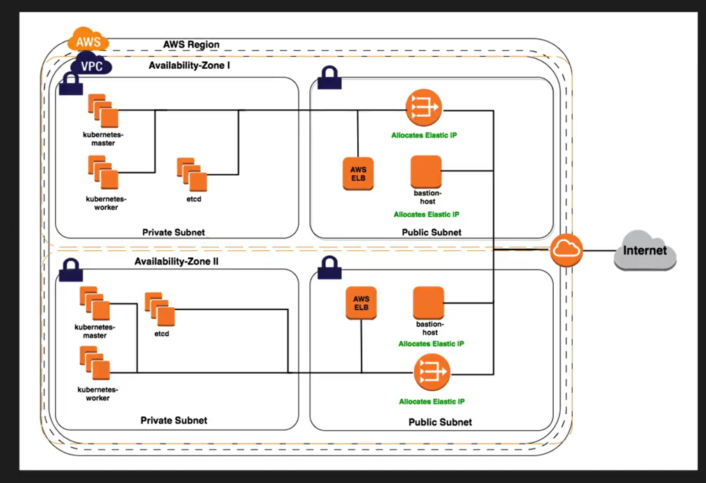

<h1 align='center'>Devops Foundation: <br> Infrastructure as Code</h1>

<p align="center">
  
</p>

---
<br><br>


<h1 align="center">Chapter 1. Modern Infrastructure & Cloud Basics</h1>
<br>

## What is Cloud Computing?

Cloud computing is **on-demand access to compute, storage, and networking** over the internet, backed by real servers in global data centers.

### Core Characteristics (NIST)
- **On-demand self-service** – provision without human interaction  
- **Broad network access** – accessible from anywhere  
- **Resource pooling** – shared provider infrastructure  
- **Rapid elasticity** – scale up/down quickly  
- **Measured service** – pay only for what you use  

<br>

## Cloud Service Models

<div style="display: flex; align-items: stretch; gap: 24px;">

  

  <div>

### SaaS – Software as a Service
- Fully managed applications  
- No infrastructure or platform management  
- Examples: Salesforce, Office 365  

### PaaS – Platform as a Service
- Deploy code, provider manages OS/runtime  
- Examples: Azure App Service, Google App Engine  

### IaaS – Infrastructure as a Service
- VM-level access with OS control  
- Examples: AWS EC2, Azure VMs, GCP Compute Engine  
- **Primary layer for Infrastructure as Code**

  </div>
</div>


<br>

## Why Cloud Enables Automation ??

| Traditional on-prem infrastructure |     | Cloud infrastructure |
|-----------------------------------|-----|----------------------|
| Weeks to procure hardware         |     | Servers in minutes  |
| Fixed capacity                    |     | Dynamic scaling (1 → 100 instantly) |
| High upfront cost                 |     | Pay-per-use         |


```
 Cloud infrastructure= Fully API-driven → **automation friendly**  
```

---
<br>

<h1 align='center'>Bare Metal vs Cloud (Reality Check) </h1>


| **Cloud Advantages** |     | **Cloud Challenges** |     | **When Bare Metal Makes Sense** |
|-----------------------------------|-----|----------------------|-----|----------------------|
| Speed and agility  |     | Can be expensive if poorly governed  |     | Very stable, predictable workloads |
| No hardware management  |     | Requires quotas, budgets, and policies  |     | Highly specialized custom hardware |
| Easy scaling |     |          |     |        |
|Built-in APIs for automation  |     |          |     |        |
|Access to GPUs, FPGAs, edge, and more |     |          |     |        |


<center> <h3> In practice, less than 10% of workloads require bare metal. </h3> </center>

---
<br>

<h1 align='center'> Modern Cloud Platforms and Managed Services </h1>

Modern cloud goes far beyond VMs and storage.

```
Modern cloud = managed services.
Instead of saying:
    “Give me a server and I’ll install a database”

You now say:
    “Give me a database service”

You work at a functional level, not infrastructure level.
```

### Managed Services
- Databases (SQL, NoSQL)
- Messaging and streaming
- DNS and CDN
- Observability and security
- Analytics and ML

Managed services let you work at a **functional level**:
- Store data
- Process events
- Translate text
- Visualize metrics

You don’t manage servers — **you consume capabilities**.

---
<br>

<h1 align='center'>Managed Services vs Bare Cloud (IaaS)</h1>

### Bare Cloud (Raw Infrastructure)
- You manage **VMs, OS, patches, scaling**
- Full control and customization
- More operational overhead
- Better for edge cases and extreme performance needs

Examples:
- Self-managed database on EC2
- Self-hosted Kubernetes cluster

```
Maximum control
Maximum effort
```
<br>

### Managed Services
- Cloud provider manages **servers, scaling, upgrades, availability**
- You focus on **configuration and usage**, not maintenance
- Faster time to value
- Reduced need for deep infra specialists

Examples:
- Managed DBs (RDS, Cloud SQL, MongoDB Atlas)
- Managed Kubernetes (EKS, AKS, GKE)

<br>

|**Pros**                                |    |**Cons**                                   |
|----------------------------------------|----|-----------------------------------        |
|Faster provisioning (minutes vs months) |    |Less low-level tuning                      |
|Less operational burden                 |    |Often behind bleeding-edge versions        |
|Easy scaling via APIs                   |    |Higher cost for convenience                |
|Ideal for startups and small teams      |    |Vendor lock-in (not portable across clouds)|


> Reality: **~90% of companies don’t need extreme customization**  
> Speed to market usually beats perfect control.

---
<br>

<h1 align='center'>Containers: The Backbone of Modern IaC</h1>

<div style="display: flex; align-items: stretch; gap: 24px;">

  <div>

### What is a Container?
A container is a **lightweight, executable package** that includes:
- Application code
- Runtime
- Libraries & dependencies
- Configuration

Runs consistently across environments.

  </div>

  

</div>

<br>


## Containers vs Virtual Machines

| Virtual Machines |    | Containers               |
|------------------|----|------------              |
| Full OS per VM   |    |Share host OS kernel      |
| Heavy, slow boot |    |Lightweight, fast         |
| More isolation   |    |Enough isolation for apps |

Containers virtualize **above the OS**, not the hardware.


<p align="center">
  
</p>

<br>

## Why Containers Matter
- Fast startup
- Small size
- Environment consistency (dev = prod)
- Perfect fit for automation and IaC

You don’t even need a full OS inside a container — just the runtime (e.g., Python, Go).

<br>

<h2 align='center'> Container Ecosystem</h2>

<div style="display: flex; align-items: stretch; gap: 24px;">

  <div>

## Container Runtimes
- Docker (most popular)
- containerd
- CRI-O
- rkt (legacy)

## Docker Images
- Built using a **Dockerfile**
- Declarative, repeatable, versioned
- Stored in image registries (Docker Hub, ECR, GCR)

    </div>
    
    
    
</div>

```
Basic idea:
- Define environment in code
- Build once
- Run anywhere
```

---
<br>

<h1 align='center'> Kubernetes: Containers at Scale</h1>

## Kubernetes:
- **Orchestrates** containers across many servers
- Handles:
  - Scheduling
  - Scaling
  - Self-healing
  - Networking
- Enables **microservices architectures**

Containers run in **pods**, spread across **nodes**, managed automatically.

<p align="center">
  
</p>

---

## Containers + IaC = Perfect Match

- Containers are built from code
- Infrastructure is provisioned from code
- Deployments become:
  - Reproducible
  - Predictable
  - Automatable

> Containers make applications portable.  
> IaC makes infrastructure repeatable.

---
<br>

<h1 align='center'> What Does “Serverless” Really Mean?</h1>

Serverless **does not mean servers don’t exist**.  
It means **you don’t manage or interact with them**.

<p align="center">
  
</p>

- Servers still run under the hood
- Cloud provider handles provisioning, scaling, patching
- You focus only on **code and logic**

Some managed services are called serverless once you no longer configure OS or system parameters, but the **core idea of serverless is FaaS**.

<br>

## Functions as a Service (FaaS)

### FaaS is the heart of serverless computing.

|**Popular FaaS Offerings**|        |**Open-source / self-managed options**|
|--------------------------|--------|--------------------------------------|
|AWS Lambda                 |       |Apache OpenWhisk                       |
|Azure Functions            |       |OpenFaaS                               |
|Google Cloud Functions     |       |Knative (runs on Kubernetes)           |

> If you run these yourself, you get flexibility — but you also get the ops work back.

<br>

## How Serverless Works Internally

- Functions are backed by **containers**
- Containers spin up in **milliseconds**
- File system is typically **read-only**
- Function executes the event
- Container disappears afterward

There are **no always-running servers** — only: Zero to many function invocations

<br>

<h2 align='center'> Traditional vs Serverless Architecture </h2>

|**Traditional Web App**           |           |**Serverless Architecture**                        |
|----------------------------------|-----------|---------------------------------------------------|
|Client → Web server                |           |No central web server                              |
|Web server hosts multiple services |           |Application is decomposed into **small functions** |
|Servers run continuously           |           |Each function handles one responsibility           |
|                                   |           |Triggered by events or HTTP requests               |

<br>

## What Triggers Serverless Functions?

| **Earlier Triggers** | **Modern Triggers**             |
| -------------------- | ------------------------------- |
| File uploads         | **HTTP requests (API Gateway)** |
| Queue messages       | Event streams                   |
| Database events      | Scheduled jobs (cron)           |

> Modern triggers made **serverless web applications** practical.

---

## Example: Serverless Web Application

### Typical Architecture Flow

| Layer             | Components            |
| ----------------- | --------------------- |
| Frontend          | React / SPA           |
| API Layer         | API Gateway           |
| Business Logic    | Lambda functions      |
| External Services | DB, Email, Accounting |

### Lambda Functions Example

| Function        | Responsibility      |
| --------------- | ------------------- |
| Login           | Authentication      |
| Create contract | Business logic      |
| Generate quote  | Pricing             |
| Create PDF      | Document generation |
| Send email      | Notifications       |

> Each API endpoint maps to **one or more functions**.
> Large systems can run **without managing a single server**.

---

## Benefits of Serverless

| Benefit           | What You Gain           |
| ----------------- | ----------------------- |
| Automatic scaling | Zero effort scaling     |
| Pay-for-use       | No traffic → no cost    |
| No OS management  | No patching or upgrades |

Serverless dramatically reduces **operational overhead**.

---

## Limitations of Serverless (Important)

| Limitation           | Impact               |
| -------------------- | -------------------- |
| Cold starts          | Slower first request |
| Execution limits     | Long jobs don’t fit  |
| Concurrency limits   | Throttling at scale  |
| Cost at high traffic | Can exceed VM costs  |

> **Rule:** Serverless is cheap when idle, expensive when very busy.

---

## Mitigating Serverless Limitations

| Problem            | Mitigation                       |
| ------------------ | -------------------------------- |
| Cold starts        | Caching, provisioned concurrency |
| Long-running tasks | Async workflows, Step Functions  |
| Cost growth        | Optimize execution paths         |

> Complexity can be **delayed**, not avoided — and that’s a feature.

---

## When Serverless Makes Sense

| Use Case         | Fit         |
| ---------------- | ----------- |
| Event processing | Excellent   |
| Queue consumers  | Excellent   |
| Background jobs  | Excellent   |
| APIs             | Very good   |
| Admin scripts    | Ideal       |
| SPAs             | Very common |

**Recommended approach:**

> Start by serverless-ifying **one component**, not everything.

---

## Why Serverless Is Powerful (Key Insight)

| Traditional Servers | Serverless                        |
| ------------------- | --------------------------------- |
| Pay for idle time   | Pay only for execution            |
| OS + infra overhead | Pure business logic               |
| Performance ≠ cost  | Performance directly affects cost |

> Serverless creates a **direct performance–cost feedback loop** —
> faster code = lower bill.


---
---
<br><br>


<h1 align="center">Chapter 2. Adventures in Automation</h1>

## Big Idea
Infrastructure can be **built, configured, and updated using code** instead of manual clicks.

Cloud + APIs make this possible at scale.


<h2> 1. Infrastructure Automation (Two Types) </h2>

| Layer             | What It Does                      | Examples                    | Focus          |
| ----------------- | --------------------------------- | --------------------------- | -------------- |
| **Provisioning**  | Creates cloud resources           | VPCs, VMs, Load Balancers   | Boxes & lines (Creating infrastructure) |
| **Configuration** | Sets up software inside resources | OS packages, apps, services | Inside the box (Configuring systems)    |


## Tools by Automation Type

| Category      | Tools                                     | Used For                |
| ------------- | ----------------------------------------- | ----------------------- |
| **Provisioning**  | Terraform, CloudFormation, AWS CDK, Boto3 | Creating infrastructure |
| **Configuration** | Ansible, Chef, Puppet                     | Configuring systems     |

> **Rule:** First provision → then configure

<br>

<h2> 2. Why Cloud Makes Automation Easy </h2>

| Traditional Infra | Cloud Infra      |
| ----------------- | ---------------- |
| Manual setup      | API-driven       |
| Slow, error-prone | Fast, repeatable |
| Fixed capacity    | Scales via code  |

```
Cloud + APIs = Automation by default
```

<br>

<h2> 3. Declarative vs Imperative</h2>

| Declarative (WHAT)     | Imperative (HOW)            |
| ---------------------- | --------------------------- |
| Define desired state   | Define step-by-step actions |
| Tool decides execution | You manage execution        |
| Safe & repeatable      | More control, more risk     |
| Auto drift correction  | Drift-prone                 |

### Examples

| Declarative (WHAT)      |     | Imperative (HOW)          |
| ------------------------| ----| --------------------------|
|You describe the **desired state** |                  |You define **step-by-step actions**|
| “I want 3 servers”                |                  |Install → copy → restart           |
| Terraform , CloudFormation        |                  |Ansible, Shell                     |
|**Pros:** Simple, safe, repeatable |                  |**Pros:** Full control             |
|**Cons:** Less control             |                  |**Cons:** Error-prone, drift issues|

> **Modern infra prefers declarative.**
> Imperative still matters *inside the box*.

<br>


<h2> 4. Terraform — Why It’s Popular </h2>

| Strength       | Why It Matters                     |
| -------------- | ---------------------------------- |
| Multi-cloud    | Same syntax across AWS, Azure, GCP |
| Declarative    | Predictable, safe changes          |
| Huge ecosystem | Providers, modules, docs           |
| Open-source    | Industry standard                  |

⚠️ Reality: Terraform **needs structure** at scale (modules, naming, state).

<br>

## Core Infrastructure Vocabulary

| Term          | Meaning                                    |
| ------------- | ------------------------------------------ |
| Box           | A running system (VM, instance, container) |
| Provisioning  | Creating infrastructure                    |
| Deployment    | Installing or updating applications        |
| Orchestration | Coordinated changes across systems         |
| Drift         | Actual state ≠ desired state               |


## Drift — The Silent Killer

| Declarative Tools | Imperative Tools   |
| ----------------- | ------------------ |
| Detect drift      | Don’t detect drift |
| Auto-correct      | Manual fixes       |
| Terraform shines  | Scripts rot        |

> Drift is why **manual servers don’t scale**.

<br>

<h2> 5. Immutable Infrastructure</h2>

### What It Means

| Traditional     | Immutable           |
| --------------- | ------------------- |
| Patch servers   | Replace servers     |
| Modify in place | Redeploy from image |
| Risky rollbacks | Easy rollbacks      |

**Flow:**

```
Build → Test → Deploy → Destroy old
```

---

## Benefits of Immutable Infra

| Benefit              | Why It Helps          |
| -------------------- | --------------------- |
| Predictability       | Same image everywhere |
| Easy rollback        | Redeploy old version  |
| Fewer bugs           | No snowflake servers  |
| Autoscaling friendly | Disposable instances  |

---

## Tools That Enable Immutability

| Tool       | Role                   |
| ---------- | ---------------------- |
| Packer     | Build VM images        |
| Docker     | Build container images |
| Kubernetes | Replace, not patch     |
| Terraform  | Recreate infra safely  |

---

## Kubernetes & the Immutable Model

| Kubernetes Concept | Immutable Principle |
| ------------------ | ------------------- |
| Pods               | Disposable          |
| Nodes              | Replaceable         |
| Desired state      | Always enforced     |
| Rollouts           | Built-in            |

You don’t SSH into Kubernetes.
You **declare**, Kubernetes **acts**.

---

## Final Rule of Thumb

```
Terraform       → Infrastructure
Ansible/Scripts → Inside the box
Packer/Docker   → Build images
Kubernetes      → Orchestration
Immutable       → Deploy, don’t patch
```

<br>


---
---
<br><br>


<h1 align="center">Chapter 3. Bringing It All Together</h1>


## Architecture Goal

<p align="center">
  
</p>


