<h1 align='center'>Devops Foundation: <br> Infrastructure as Code</h1>

<p align="center">
  
</p>

---
<br><br>


<h1 align="center">☁️⚙️ Chapter 1. Modern Infrastructure & Cloud Basics 🏗️☁️</h1>
<br>

## ☁️ What is Cloud Computing?

Cloud computing is **on-demand access to compute, storage, and networking** over the internet, backed by real servers in global data centers.

### Core Characteristics (NIST)
- **On-demand self-service** – provision without human interaction  
- **Broad network access** – accessible from anywhere  
- **Resource pooling** – shared provider infrastructure  
- **Rapid elasticity** – scale up/down quickly  
- **Measured service** – pay only for what you use  

<br>

## Cloud Service Models


| | |
|---|---|
|  | **SaaS – Software as a Service**<br>• Fully managed applications<br>• No infrastructure or platform management<br>• Examples: Salesforce, Office 365<br><br>**PaaS – Platform as a Service**<br>• Deploy code, provider manages OS/runtime<br>• Examples: Azure App Service, Google App Engine<br><br>**IaaS – Infrastructure as a Service**<br>• VM-level access with OS control<br>• Examples: AWS EC2, Azure VMs, GCP Compute Engine<br>• **Primary layer for Infrastructure as Code** |


<br>

## ⚙️ Why Cloud Enables Automation ??

| Traditional on-prem infrastructure |     | Cloud infrastructure |
|-----------------------------------|-----|----------------------|
| Weeks to procure hardware         |     | Servers in minutes  |
| Fixed capacity                    |     | Dynamic scaling (1 → 100 instantly) |
| High upfront cost                 |     | Pay-per-use         |


```
 Cloud infrastructure= Fully API-driven → automation friendly 
```


<br>

<h1 align='center'>Bare Metal vs Cloud (Reality Check) </h1>


| **Cloud Advantages** |     | **Cloud Challenges** |     | **When Bare Metal Makes Sense** |
|-----------------------------------|-----|----------------------|-----|----------------------|
| Speed and agility  |     | Can be expensive if poorly governed  |     | Very stable, predictable workloads |
| No hardware management  |     | Requires quotas, budgets, and policies  |     | Highly specialized custom hardware |
| Easy scaling |     |          |     |        |
|Built-in APIs for automation  |     |          |     |        |
|Access to GPUs, FPGAs, edge, and more |     |          |     |        |


<center> <h3> In practice, less than 10% of workloads require bare metal. </h3> </center>


<br>

<h1 align='center'> Modern Cloud Platforms and Managed Services </h1>

Modern cloud goes far beyond VMs and storage.

```
Modern cloud = managed services.
Instead of saying:
    “Give me a server and I’ll install a database”

You now say:
    “Give me a database service”

You work at a functional level, not infrastructure level.
```

### Managed Services
- Databases (SQL, NoSQL)
- Messaging and streaming
- DNS and CDN
- Observability and security
- Analytics and ML

Managed services let you work at a **functional level**:
- Store data
- Process events
- Translate text
- Visualize metrics

You don’t manage servers — **you consume capabilities**.


<br>

<h1 align='center'>Managed Services vs Bare Cloud (IaaS)</h1>

### Bare Cloud (Raw Infrastructure)
- You manage **VMs, OS, patches, scaling**
- Full control and customization
- More operational overhead
- Better for edge cases and extreme performance needs

Examples:
- Self-managed database on EC2
- Self-hosted Kubernetes cluster

```
Maximum control
Maximum effort
```
<br>

### Managed Services
- Cloud provider manages **servers, scaling, upgrades, availability**
- You focus on **configuration and usage**, not maintenance
- Faster time to value
- Reduced need for deep infra specialists

Examples:
- Managed DBs (RDS, Cloud SQL, MongoDB Atlas)
- Managed Kubernetes (EKS, AKS, GKE)

<br>

|**Pros**                                |    |**Cons**                                   |
|----------------------------------------|----|-----------------------------------        |
|Faster provisioning (minutes vs months) |    |Less low-level tuning                      |
|Less operational burden                 |    |Often behind bleeding-edge versions        |
|Easy scaling via APIs                   |    |Higher cost for convenience                |
|Ideal for startups and small teams      |    |Vendor lock-in (not portable across clouds)|


> Reality: **~90% of companies don’t need extreme customization**  
> Speed to market usually beats perfect control.


<br>

<h1 align='center'>📦🐳 Containers: The Backbone of Modern IaC</h1>

## 📦 What is a Container?

| | |
|---|---|
| **A container is a lightweight, executable package that includes:**<br><br>• Application code<br>• Runtime<br>• Libraries & dependencies<br>• Configuration<br><br>Runs consistently across environments. |  |


<br>


## Containers vs Virtual Machines

| Virtual Machines |    | Containers               |
|------------------|----|------------              |
| Full OS per VM   |    |Share host OS kernel      |
| Heavy, slow boot |    |Lightweight, fast         |
| More isolation   |    |Enough isolation for apps |

Containers virtualize **above the OS**, not the hardware.


<p align="center">
  
</p>

<br>

## Why Containers Matter
- Fast startup
- Small size
- Environment consistency (dev = prod)
- Perfect fit for automation and IaC

You don’t even need a full OS inside a container — just the runtime (e.g., Python, Go).

<br>

<h2 align='center'> Container Ecosystem</h2>

## Container Ecosystem

| |  | |
|---|---|---|
| **Container Runtimes**<br><br>• Docker (most popular)<br>• containerd<br>• CRI-O<br>• rkt (legacy)<br><br><br>**Docker Images**<br><br>• Built using a **Dockerfile**<br>• Declarative, repeatable, versioned<br>• Stored in registries (Docker Hub, ECR, GCR) |   |  |


```
Basic idea:
- Define environment in code
- Build once
- Run anywhere
```


<br>

<h1 align='center'> ☸️ Kubernetes: Containers at Scale</h1>

## Kubernetes:
- **Orchestrates** containers across many servers ☸️📦
- Handles:
  - Scheduling
  - Scaling
  - Self-healing
  - Networking
- Enables **microservices architectures**

Containers run in **pods**, spread across **nodes**, managed automatically.

<p align="center">
  
</p>

<br>

## Containers + IaC = Perfect Match

- Containers are built from code
- Infrastructure is provisioned from code
- Deployments become:
  - Reproducible
  - Predictable
  - Automatable

> Containers make applications portable.  
> IaC makes infrastructure repeatable.


<br>

<h1 align='center'> What Does “Serverless” Really Mean?</h1>

Serverless **does not mean servers don’t exist**.  
It means **you don’t manage or interact with them**.

<p align="center">
  
</p>

- Servers still run under the hood
- Cloud provider handles provisioning, scaling, patching
- You focus only on **code and logic**

Some managed services are called serverless once you no longer configure OS or system parameters, but the **core idea of serverless is FaaS**.

<br>

## Functions as a Service (FaaS)

### FaaS is the heart of serverless computing.

|**Popular FaaS Offerings**|        |**Open-source / self-managed options**|
|--------------------------|--------|--------------------------------------|
|AWS Lambda                 |       |Apache OpenWhisk                       |
|Azure Functions            |       |OpenFaaS                               |
|Google Cloud Functions     |       |Knative (runs on Kubernetes)           |

> If you run these yourself, you get flexibility — but you also get the ops work back.

<br>

## How Serverless Works Internally

- Functions are backed by **containers**
- Containers spin up in **milliseconds**
- File system is typically **read-only**
- Function executes the event
- Container disappears afterward

There are **no always-running servers** — only: Zero to many function invocations

<br>

<h2 align='center'> Traditional vs Serverless Architecture </h2>

|**Traditional Web App**           |           |**Serverless Architecture**                        |
|----------------------------------|-----------|---------------------------------------------------|
|Client → Web server                |           |No central web server                              |
|Web server hosts multiple services |           |Application is decomposed into **small functions** |
|Servers run continuously           |           |Each function handles one responsibility           |
|                                   |           |Triggered by events or HTTP requests               |

<br>

## What Triggers Serverless Functions?

| **Earlier Triggers** | **Modern Triggers**             |
| -------------------- | ------------------------------- |
| File uploads         | **HTTP requests (API Gateway)** |
| Queue messages       | Event streams                   |
| Database events      | Scheduled jobs (cron)           |

> Modern triggers made **serverless web applications** practical.

---

## Example: Serverless Web Application

### Typical Architecture Flow

| Layer             | Components            |
| ----------------- | --------------------- |
| Frontend          | React / SPA           |
| API Layer         | API Gateway           |
| Business Logic    | Lambda functions      |
| External Services | DB, Email, Accounting |

### Lambda Functions Example

| Function        | Responsibility      |
| --------------- | ------------------- |
| Login           | Authentication      |
| Create contract | Business logic      |
| Generate quote  | Pricing             |
| Create PDF      | Document generation |
| Send email      | Notifications       |

> Each API endpoint maps to **one or more functions**.
> Large systems can run **without managing a single server**.

---

## Benefits of Serverless

| Benefit           | What You Gain           |
| ----------------- | ----------------------- |
| Automatic scaling | Zero effort scaling     |
| Pay-for-use       | No traffic → no cost    |
| No OS management  | No patching or upgrades |

Serverless dramatically reduces **operational overhead**.

<br>

## Limitations of Serverless (Important)

| Limitation           | Impact               |
| -------------------- | -------------------- |
| Cold starts          | Slower first request |
| Execution limits     | Long jobs don’t fit  |
| Concurrency limits   | Throttling at scale  |
| Cost at high traffic | Can exceed VM costs  |

> **Rule:** Serverless is cheap when idle, expensive when very busy.

<br>

## Mitigating Serverless Limitations

| Problem            | Mitigation                       |
| ------------------ | -------------------------------- |
| Cold starts        | Caching, provisioned concurrency |
| Long-running tasks | Async workflows, Step Functions  |
| Cost growth        | Optimize execution paths         |

> Complexity can be **delayed**, not avoided — and that’s a feature.

<br>

## When Serverless Makes Sense

| Use Case         | Fit         |
| ---------------- | ----------- |
| Event processing | Excellent   |
| Queue consumers  | Excellent   |
| Background jobs  | Excellent   |
| APIs             | Very good   |
| Admin scripts    | Ideal       |
| SPAs             | Very common |

**Recommended approach:**

> Start by serverless-ifying **one component**, not everything.

<br>

## Why Serverless Is Powerful (Key Insight)

| Traditional Servers | Serverless                        |
| ------------------- | --------------------------------- |
| Pay for idle time   | Pay only for execution            |
| OS + infra overhead | Pure business logic               |
| Performance ≠ cost  | Performance directly affects cost |

> Serverless creates a **direct performance–cost feedback loop** —
> faster code = lower bill.


---
---
<br><br>


<h1 align='center'> 🤖⚙️ Chapter 2. Adventures in Automation 🛠️⚙️</h1>

## Big Idea

Infrastructure can be **built, configured, and updated using code** instead of manual clicks.

Cloud + APIs make this possible at scale.

<br>

<h1 align='center'> 1. Infrastructure Automation (Two Types)</h1>

|                                                                                                                                                                                                     |                                                                       |
| --------------------------------------------------------------------------------------------------------------------------------------------------------------------------------------------------- | --------------------------------------------------------------------- |
| **Two layers of automation exist in real systems:**<br><br>• Provisioning → creates resources<br>• Configuration → sets up software<br><br>They solve **different problems** and must not be mixed. | 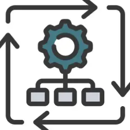 |

<br>

| Layer             | What It Does                      | Examples                    | Focus          |
| ----------------- | --------------------------------- | --------------------------- | -------------- |
| **Provisioning**  | Creates cloud resources           | VPCs, VMs, Load Balancers   | Boxes & lines (Creating infrastructure)  |
| **Configuration** | Sets up software inside resources | OS packages, apps, services | Inside the box |

<br>

## Tools by Automation Type

| Category          | Tools                                     | Used For                |
| ----------------- | ----------------------------------------- | ----------------------- |
| **Provisioning**  | Terraform, CloudFormation, AWS CDK, Boto3 | Creating infrastructure |
| **Configuration** | Ansible, Chef, Puppet                     | Configuring systems     |

> **Rule:** First provision → then configure

<br>

<h1 align='center'> 2. Why Cloud Makes Automation Easy</h1>

|                                                                                                                                                                |                                                                    |
| -------------------------------------------------------------------------------------------------------------------------------------------------------------- | ------------------------------------------------------------------ |
| Cloud resources expose **APIs** by default.<br><br>This turns infrastructure into **code-addressable objects**, enabling automation, repeatability, and scale. | 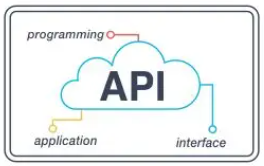 |

<br>

| Traditional Infra | Cloud Infra      |
| ----------------- | ---------------- |
| Manual setup      | API-driven       |
| Slow, error-prone | Fast, repeatable |
| Fixed capacity    | Scales via code  |

```
Cloud + APIs = Automation by default
```

<br>

<h1 align='center'> 3. Declarative vs Imperative</h1>

| Declarative (WHAT)     | Imperative (HOW)            |
| ---------------------- | --------------------------- |
| Define desired state   | Define step-by-step actions |
| Tool decides execution | You manage execution        |
| Safe & repeatable      | More control, more risk     |
| Auto drift correction  | Drift-prone                 |

### Examples

| Declarative (WHAT)                 |   | Imperative (HOW)           |
| ---------------------------------- | - | -------------------------- |
| You describe the **desired state** |   | You define **exact steps** |
| “I want 3 servers”                 |   | Install → copy → restart   |
| Terraform, CloudFormation          |   | Ansible, Shell             |
| **Pros:** Simple, safe             |   | **Pros:** Full control     |
| **Cons:** Less control             |   | **Cons:** Drift-prone      |

> **Modern infra prefers declarative.**
> Imperative still matters *inside the box*.

<br>

<h1 align='center'> 4. Terraform — Why It’s Popular</h1>

|                                                                                                                          |                                                                  |
| ------------------------------------------------------------------------------------------------------------------------ | ---------------------------------------------------------------- |
| Terraform abstracts cloud APIs into a **single declarative language**, making infrastructure predictable and repeatable. | 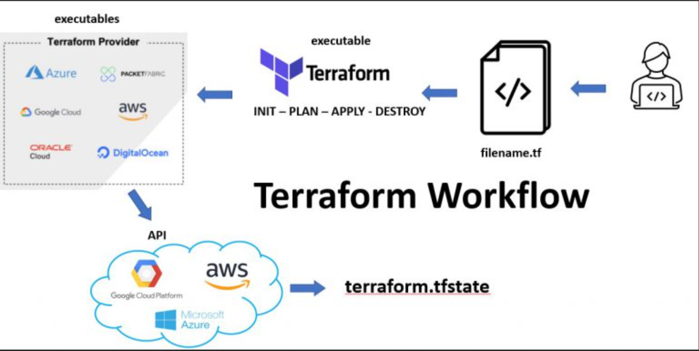 |

<br>

| Strength       | Why It Matters                     |
| -------------- | ---------------------------------- |
| Multi-cloud    | Same syntax across AWS, Azure, GCP |
| Declarative    | Predictable, safe changes          |
| Huge ecosystem | Providers, modules, docs           |
| Open-source    | Industry standard                  |

⚠️ Reality: Terraform **needs structure** at scale (modules, naming, state).

<br>

## Core Infrastructure Vocabulary

| Term          | Meaning                                    |
| ------------- | ------------------------------------------ |
| Box           | A running system (VM, instance, container) |
| Provisioning  | Creating infrastructure                    |
| Deployment    | Installing or updating applications        |
| Orchestration | Coordinated changes across systems         |
| Drift         | Actual state ≠ desired state               |

<br>

## Drift — The Silent Killer

|                                                                                                 |                                                            |
| ----------------------------------------------------------------------------------------------- | ---------------------------------------------------------- |
| Drift happens when **manual changes bypass code**.<br><br>This silently breaks reproducibility. | 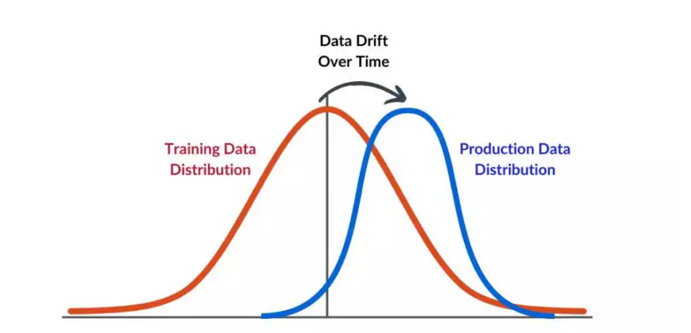 |

<br>

| Declarative Tools | Imperative Tools   |
| ----------------- | ------------------ |
| Detect drift      | Don’t detect drift |
| Auto-correct      | Manual fixes       |
| Terraform shines  | Scripts rot        |

> Drift is why **manual servers don’t scale**.

<br>

<h1 align='center'> 5. Immutable Infrastructure</h1>

### What It Means

| Traditional     | Immutable           |
| --------------- | ------------------- |
| Patch servers   | Replace servers     |
| Modify in place | Redeploy from image |
| Risky rollbacks | Easy rollbacks      |

**Flow:**

```
Build → Test → Deploy → Destroy old
```

<br>

## Benefits of Immutable Infra

|                                                                                                   |                                                                    |
| ------------------------------------------------------------------------------------------------- | ------------------------------------------------------------------ |
| Immutable infrastructure eliminates **snowflake servers** and enables safe scaling and rollbacks. <br>
Servers are **not modified after deployment**. They are **replaced**, not patched. | 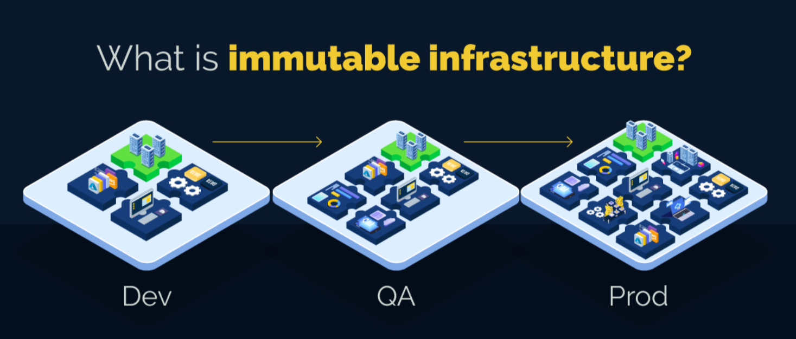 |

<br>

| Benefit              | Why It Helps          |
| -------------------- | --------------------- |
| Predictability       | Same image everywhere |
| Easy rollback        | Redeploy old version  |
| Fewer bugs           | No snowflake servers  |
| Autoscaling friendly | Disposable instances  |

<br>

## Tools That Enable Immutability

| Tool       | Role                   |
| ---------- | ---------------------- |
| Packer     | Build VM images        |
| Docker     | Build container images |
| Kubernetes | Replace, not patch     |
| Terraform  | Recreate infra safely  |

<br>

<h1 align='center'> 6. ☸️ Kubernetes & the Immutable Model</h1>

|                                                                                                      |                                                                    |
| ---------------------------------------------------------------------------------------------------- | ------------------------------------------------------------------ |
| Kubernetes enforces **desired state continuously**, making immutability the default operating model. | 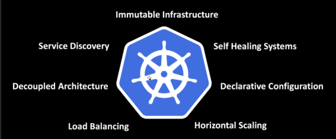 |

<br>

| Kubernetes Concept | Immutable Principle |
| ------------------ | ------------------- |
| Pods               | Disposable          |
| Nodes              | Replaceable         |
| Desired state      | Always enforced     |
| Rollouts           | Built-in            |

You don’t SSH into Kubernetes.
You **declare**, Kubernetes **acts**.

<br>

## Final Rule of Thumb

```
Terraform       → Infrastructure
Ansible/Scripts → Inside the box
Packer/Docker   → Build images
Kubernetes      → Orchestration
Immutable       → Deploy, don’t patch
```


---
---
<br><br>


<h1 align="center"> 🔗⚙️ Chapter 3. Bringing It All Together 🔗⚙️</h1>

# Provisioning Lab

## Tools Used in the Lab
- **Terraform** → create cloud infrastructure
- **Ansible** → install and configure Kubernetes
- **Kubespray** → open-source project combining Terraform + Ansible
- **AWS** → cloud provider

<br>

<h1 align='center'> 1. ☁️🖥️ AWS</h1>

```
Important AWS Security Rules
- ❌ Do NOT use root account
- ✅ Create IAM admin user
- ✅ Enable MFA on all accounts
- ✅ Use access keys for automation
```

<br>

[Simplified Theory](./aws.md) 

**AWS (Amazon Web Services)** is a cloud platform that lets you rent servers, storage, databases, and networking over the internet. 
- Instead of buying physical machines, you create resources in minutes and pay only for what you use.

- Everything in AWS can be created, modified, or deleted using the console or automation tools like Terraform, making it ideal for modern cloud and DevOps workflows.


<br>

<h1 align='center'> 2. 🏗️ Terraform </h1>

[Simplified Theory + project](./terraform.md)


Terraform lets you **create and manage cloud infrastructure using code** instead of clicking in the AWS console.

* All servers, networks, and security are **defined in files**
* Terraform reads those files and **builds everything automatically**
* The `tfvars` file is where you change settings like **number of servers**
* Terraform keeps a **state file** to remember what it created

To make changes:

1. Update the code (e.g., workers: 3 → 4)
2. Run `terraform plan` to preview changes
3. Run `terraform apply` to make it real

👉 Result: **safe, repeatable, and error-free infrastructure changes**

That’s why Terraform is the backbone of modern cloud automation.


<br>

<h1 align='center'> 3. ⚙️📜 Ansible</h1>

[Simplified Theory](./ansible.md)


Ansible is a **configuration management tool** that installs software and configures servers automatically.

* **Purpose:** Set up software, configure systems, orchestrate workflows
* **How it works:** Uses **playbooks** (YAML files) that define tasks
* **Inventory file:** Lists servers and roles (e.g., control plane vs worker nodes)
* **Commands:**

  * `ansible-playbook <file.yml> -i <inventory>` → runs tasks on servers
* **Example:** Install Kubernetes on multiple nodes automatically
* **Key advantage:** Repeatable, safe, scales easily, reduces manual errors

**One-liner:**

> Ansible turns server setup and software configuration into code, letting you automate hundreds of tasks reliably across many machines.


<br>

<h1 align='center'> 4. 🐳📦 Docker</h1>

[Simplified Theory](./docker.md)


Docker lets you **package an application and everything it needs** into a **lightweight, portable container**.

* Build a **Docker image** → includes OS + app + dependencies
* Run a **container** → isolated instance of that image
* Map ports → access your app locally or on a server
* Push to **Docker Hub** → share with anyone, anywhere
* Containers are **ephemeral** → easy to recreate, update, or scale

> Docker = consistent environments + easier deployments + micro VMs.


<br>

<h1 align='center'> 5. Helm Chart</h1>

Helm is **Kubernetes’ package manager**, letting you deploy applications as **charts** (pre-configured templates for Kubernetes resources). Think of it like **Terraform for Kubernetes apps**.

### 1. **Why Helm?**

* Automates deploying apps to Kubernetes
* Packages all Kubernetes manifests into a single reusable chart
* Supports configuration through a `values.yaml` file
* Handles updates, scaling, and versioning

### 2. **Core Concepts**

* **Chart** – a package containing Kubernetes resources (Deployments, Services, Ingress, etc.)
* **values.yaml** – top-level configuration, like `terraform.tfvars`
* **Templates** – YAML files that generate Kubernetes manifests dynamically
* **Repository** – source of ready-to-use charts (e.g., Bitnami)

### 3. **Typical Workflow**

1. Install Helm on your system
2. Add repositories and search for charts (`helm repo add`, `helm search`)
3. Pull or create a chart (`helm pull`, `helm create`)
4. Customize `values.yaml` (e.g., replica count, ports, container image)
5. Validate & dry-run (`helm template --validate --debug`)
6. Deploy to Kubernetes (`helm install <release-name> <chart-dir> -f values.yaml`)
7. Verify (`helm list`, `kubectl get pods`)

### 4. **Example Use Case**

Deploying a Word Cloud Generator app:

* Helm chart created using `helm create wordcloud`
* Configured to run 3 replicas, use a load balancer, and set the correct container image/tag
* Validated, dry-run, then installed on the Kubernetes cluster
* Result: 3 pods running, accessible externally via the ELB

> **Key takeaway:** Helm makes Kubernetes application deployment **repeatable, configurable, and scalable**, just like Terraform does for infrastructure.

<br>

```
IMPORTANT:
Helm and Helm chart are related, but not the same thing:
```

| Term           | Meaning                                                                                                         |
| -------------- | --------------------------------------------------------------------------------------------------------------- |
| **Helm**       | The **tool/CLI** you use to manage applications on Kubernetes. Think of it as the “apt” or “brew” for K8s apps. |
| **Helm chart** | A **package** (like a recipe) that contains all the Kubernetes resources and templates needed to deploy an app. |


---
---
<br><br>


<h1 align='center'> 🤖⚙️ Chapter 4. With Great Power Comes Great Responsibilities 🛠️⚙️ </h1>

# 🏗️ Infrastructure as Code (IaC)

<p align="center">
  
</p>

<br>

## 📌 What is Infrastructure as Code?

**Infrastructure as Code (IaC)** is an approach to infrastructure automation that applies **software development principles**—such as version control, testing, CI/CD, and repeatability—to infrastructure.

Instead of manually configuring servers or cloud resources, **everything is defined and managed using code**.

> *Definition (Keif Morris):*
> *Infrastructure as Code is an approach to infrastructure automation based on software development practices, emphasizing consistent, repeatable routines for provisioning and changing systems and their configuration.*

📌 **Short takeaway:**
IaC turns infrastructure into **versioned, testable, and repeatable code**, just like application software.


## 🐄 Servers as Cattle, Not Pets

<p align="center">
  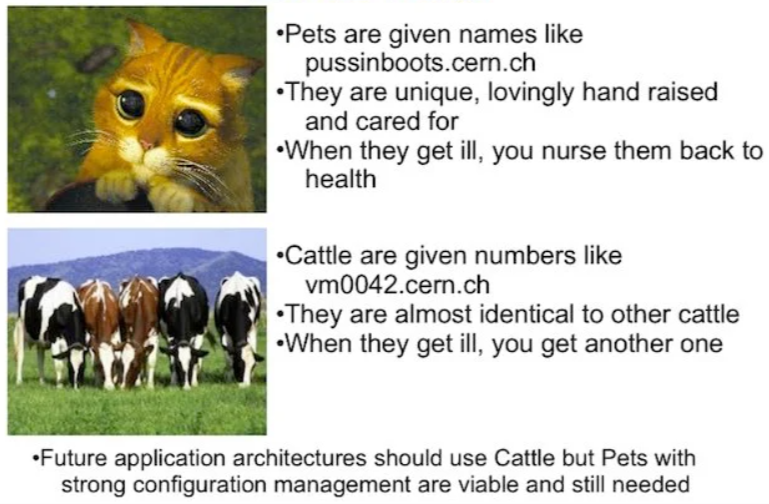
</p>

Traditionally, servers were treated like *pets*—manually configured, lovingly maintained, and feared when they broke. IaC flips this mindset.

* Servers are **mass-produced**, not handcrafted
* If something breaks → **destroy and recreate**
* Customization lives in **code**, not SSH sessions

📌 **Short takeaway:**
IaC enforces disposability and consistency, eliminating fragile “snowflake servers”.


## 🧠 IaC Is a Cultural Shift (Not Just Tools)

IaC is more about **how teams work** than which tool they use.

Instead of:

* Logging into servers
* Making manual fixes
* Writing documentation after the fact

You:

* Change code
* Test it
* Deploy it via automation

📌 **Short takeaway:**
IaC requires discipline—*all changes go through code*, no exceptions.

> 👉 *Deep dive candidate:* Cultural change, DevOps mindset, and resistance to automation.

<br>

## 🔁 Continuous Integration for Infrastructure

<p align="center">
  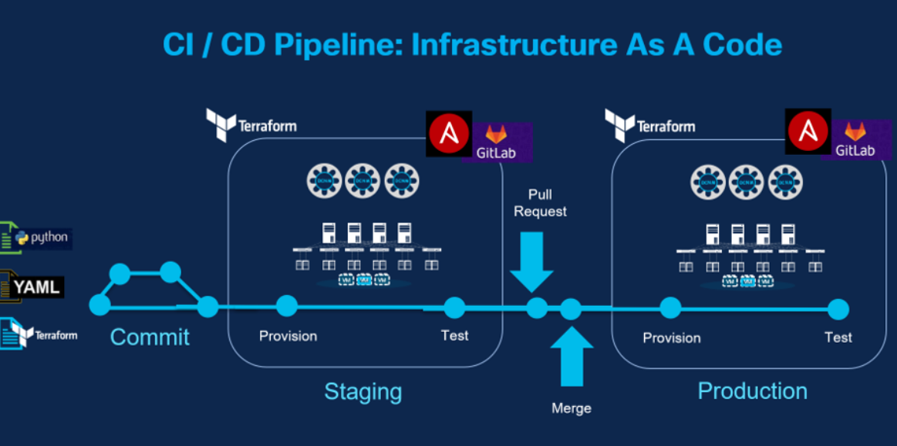
</p>

IaC enables **CI/CD pipelines for infrastructure**, just like application code.

### Typical Flow

```
Code → Build → Test → Artifact → Deploy
```

Benefits:

* Small, traceable changes
* Easy rollback
* No "live fixes" in production

📌 **Short takeaway:**
Infrastructure should be built and deployed **only via pipelines**, never from laptops.

> 👉 *Deep dive candidate:* CI tools, pipelines, approvals, and promotion strategies.

<br>

## 📦 Artifacts in Infrastructure

Artifacts are **immutable, versioned outputs** of a build process.

### Common Infrastructure Artifacts

* Docker images
* AMIs / VM images
* ZIP packages
* OS packages (RPM, DEB)

<p align="center">
  
</p>

📌 **Short takeaway:**
Artifacts must **never change after creation**—immutability is non-negotiable.

> 👉 *Deep dive candidate:* Artifact repositories, versioning strategies, and promotion models.

<br>

## 🧪 Testing Infrastructure

<p align="center">
  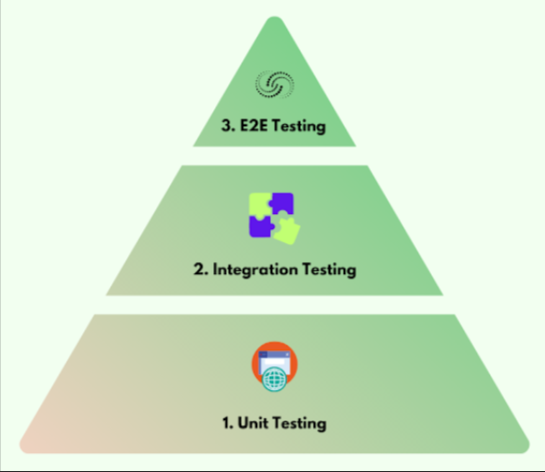
</p>

Infrastructure testing follows the **testing pyramid**.

### 1️⃣ Unit Testing

* Smallest testable blocks
* Linters, formatters, dry-runs
* Fast and cheap

### 2️⃣ Integration Testing

* Deploy real infrastructure in test env
* Validate resources actually work

### 3️⃣ End-to-End Testing

* Full system validation
* Slow and expensive
* Use sparingly

📌 **Short takeaway:**
Test infra like software—**more unit tests, fewer end-to-end tests**.

> 👉 *Deep dive candidate:* Terratest, Kitchen-Terraform, testing strategies.

<br>

## ❌ “Works on My Machine” Problem

<p align="center">
  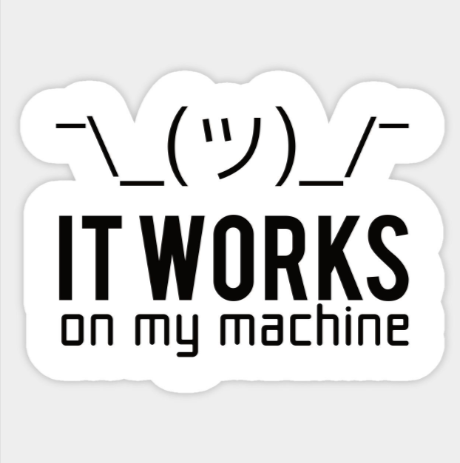
</p>

IaC solves environment drift by enforcing:

1. Versioned artifacts
2. Production-like environments
3. Identical deployment mechanisms

📌 **Short takeaway:**
If environments are built from the same code, **behavior becomes predictable**.

<br>

## 🧑‍💻 You Write It, You Run It

IaC naturally leads to **shared responsibility**.

* Developers own infrastructure they create
* Faster feedback loops
* Better reliability

Observability + on-call ownership ensures real fixes, not band-aids.

📌 **Short takeaway:**
The person who writes the code is best positioned to support it.

> 👉 *Deep dive candidate:* SRE model, on-call practices, incident response.

<br>

## ⚙️ Automate Everything (That Makes Sense)

Beyond infrastructure, many system components can be treated as code:

* Monitoring dashboards
* Alerts
* Runbooks
* Documentation
* SaaS configurations

<p align="center">
  
</p>

📌 **Short takeaway:**
If it affects reliability, performance, or security—**it belongs in code**.

<br>

## 🔄 GitOps Model (Bonus)

<p align="center">
  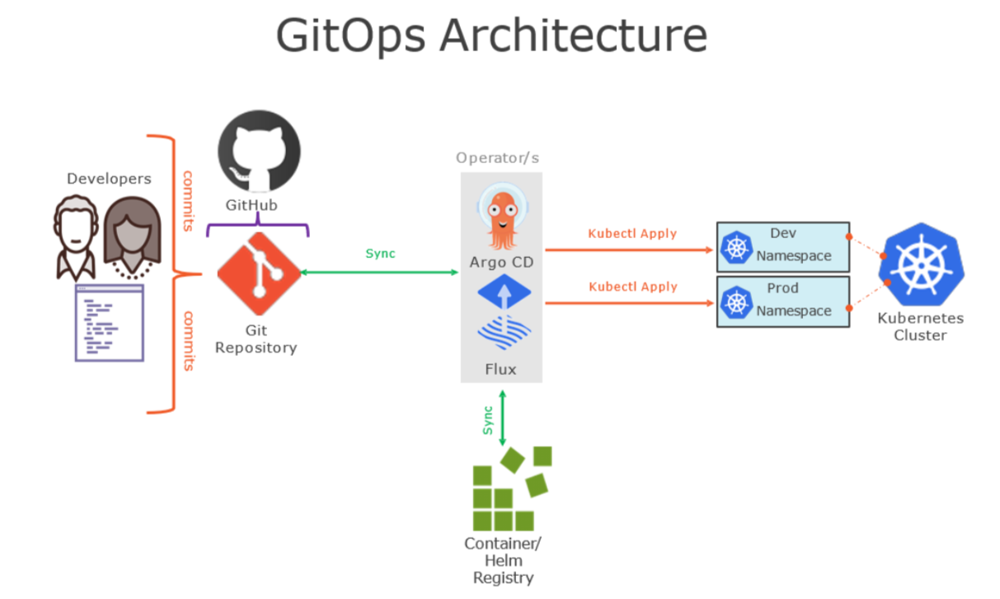
</p>

GitOps uses **Git as the single source of truth** for declarative systems.

### GitOps Principles

1. Declarative
2. Versioned & immutable
3. Pulled automatically
4. Continuously reconciled

📌 **Short takeaway:**
GitOps is powerful—but not mandatory. It works best with **Kubernetes and declarative systems**.

> 👉 *Deep dive candidate:* GitOps vs traditional CI/CD, pros & cons.

<br>

## 🌱 Greenfield vs Brownfield

| Greenfield        | Brownfield        |
| ----------------- | ----------------- |
| Start fresh       | Existing systems  |
| Easy IaC adoption | Gradual migration |
| Fewer constraints | Legacy complexity |

📌 **Short takeaway:**
Start greenfield when possible; in brownfield, automate **one painful process at a time**.

---

## 🎯 Final Key Principles

```
Define → Build → Test → Deploy
No manual changes
Everything versioned
Infrastructure = software
```

| **IaC Reduces** 🟥        | **IaC Increases** 🟩     |
|-------------------------|--------------------------|
| Human error             | Speed                     |
| Inconsistency           | Reliability               |
| Operational stress      | Confidence                |


---

