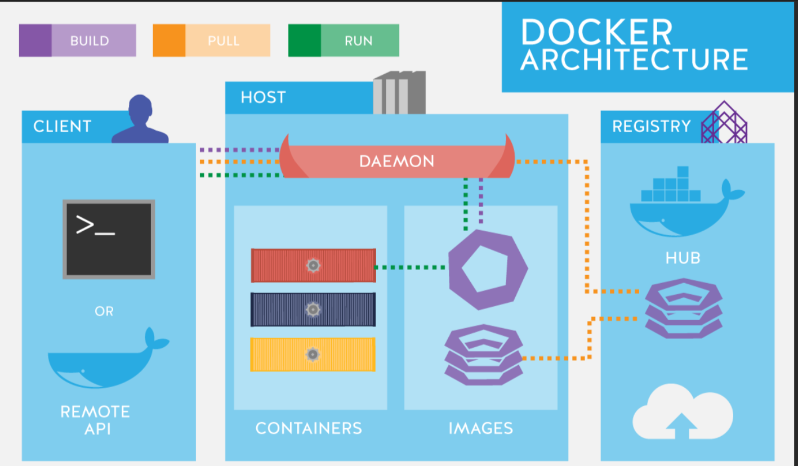

<h1 align='center'>Devops Foundation: <br> Infrastructure as Code</h1>

---
<br><br>


<h1 align="center">Chapter 1. Modern Infrastructure & Cloud Basics</h1>
<br>

## What is Cloud Computing?

Cloud computing is **on-demand access to compute, storage, and networking** over the internet, backed by real servers in global data centers.

### Core Characteristics (NIST)
- **On-demand self-service** – provision without human interaction  
- **Broad network access** – accessible from anywhere  
- **Resource pooling** – shared provider infrastructure  
- **Rapid elasticity** – scale up/down quickly  
- **Measured service** – pay only for what you use  

<br>

## Cloud Service Models


<p align="center">
  
</p>


### SaaS – Software as a Service
- Fully managed applications  
- No infrastructure or platform management  
- Examples: Salesforce, Office 365  

### PaaS – Platform as a Service
- Deploy code, provider manages OS/runtime  
- Examples: Azure App Service, Google App Engine  

### IaaS – Infrastructure as a Service
- VM-level access with OS control  
- Examples: AWS EC2, Azure VMs, GCP Compute Engine  
- **Primary layer for Infrastructure as Code**

<br>

## Why Cloud Enables Automation

Traditional on-prem infrastructure:
- Weeks to procure hardware  
- Fixed capacity  
- High upfront cost  

Cloud infrastructure:
- Servers in minutes  
- Dynamic scaling (1 → 100 instantly)  
- Pay-per-use  
- Fully API-driven → **automation friendly**  

---
<br>

<h1 align='center'>Bare Metal vs Cloud (Reality Check) </h1>

### Cloud Advantages
- Speed and agility  
- No hardware management  
- Easy scaling  
- Built-in APIs for automation  
- Access to GPUs, FPGAs, edge, and more  

### Cloud Challenges
- Can be expensive if poorly governed  
- Requires quotas, budgets, and policies  

### When Bare Metal Makes Sense
- Very stable, predictable workloads  
- Highly specialized custom hardware  

> In practice, **less than 10% of workloads require bare metal**.

---
<br>

<h1 align='center'> Modern Cloud Platforms and Managed Services </h1>

Modern cloud goes far beyond VMs and storage.
```
Modern cloud = managed services.
Instead of saying:
    “Give me a server and I’ll install a database”

You now say:
    “Give me a database service”

You work at a functional level, not infrastructure level.
```
### Managed Services
- Databases (SQL, NoSQL)
- Messaging and streaming
- DNS and CDN
- Observability and security
- Analytics and ML

Managed services let you work at a **functional level**:
- Store data
- Process events
- Translate text
- Visualize metrics

You don’t manage servers — **you consume capabilities**.

---
<br>


<h1 align='center'>Managed Services vs Bare Cloud (IaaS)</h1>

### Bare Cloud (Raw Infrastructure)
- You manage **VMs, OS, patches, scaling**
- Full control and customization
- More operational overhead
- Better for edge cases and extreme performance needs

Examples:
- Self-managed database on EC2
- Self-hosted Kubernetes cluster

```
Maximum control
Maximum effort
```
<br>

### Managed Services
- Cloud provider manages **servers, scaling, upgrades, availability**
- You focus on **configuration and usage**, not maintenance
- Faster time to value
- Reduced need for deep infra specialists

Examples:
- Managed DBs (RDS, Cloud SQL, MongoDB Atlas)
- Managed Kubernetes (EKS, AKS, GKE)

<br>

**Pros**
- Faster provisioning (minutes vs months)
- Less operational burden
- Easy scaling via APIs
- Ideal for startups and small teams

**Cons**
- Less low-level tuning
- Often behind bleeding-edge versions
- Higher cost for convenience
- Vendor lock-in (not portable across clouds)

> Reality: **~90% of companies don’t need extreme customization**  
> Speed to market usually beats perfect control.

---
<br>

<h1 align='center'>Containers: The Backbone of Modern IaC</h1>

### What is a Container?
A container is a **lightweight, executable package** that includes:
- Application code
- Runtime
- Libraries & dependencies
- Configuration

Runs consistently across environments.

---

### Containers vs Virtual Machines

| Virtual Machines | Containers |
|------------------|------------|
| Full OS per VM   | Share host OS kernel |
| Heavy, slow boot | Lightweight, fast |
| More isolation   | Enough isolation for apps |

Containers virtualize **above the OS**, not the hardware.


<p align="center">
  
</p>

---

### Why Containers Matter
- Fast startup
- Small size
- Environment consistency (dev = prod)
- Perfect fit for automation and IaC

You don’t even need a full OS inside a container — just the runtime (e.g., Python, Go).

---

## Container Ecosystem

### Container Runtimes
- Docker (most popular)
- containerd
- CRI-O
- rkt (legacy)

### Docker Images
- Built using a **Dockerfile**
- Declarative, repeatable, versioned
- Stored in image registries (Docker Hub, ECR, GCR)

Basic idea:
- Define environment in code
- Build once
- Run anywhere


<p align="center">
  
</p>


---
<br>

<h1 align='center'> Kubernetes: Containers at Scale</h1>

## Kubernetes:
- **Orchestrates** containers across many servers
- Handles:
  - Scheduling
  - Scaling
  - Self-healing
  - Networking
- Enables **microservices architectures**

Containers run in **pods**, spread across **nodes**, managed automatically.

<p align="center">
  
</p>

---

## Containers + IaC = Perfect Match

- Containers are built from code
- Infrastructure is provisioned from code
- Deployments become:
  - Reproducible
  - Predictable
  - Automatable

> Containers make applications portable.  
> IaC makes infrastructure repeatable.

---
<br>

<h1 align='center'> What Does “Serverless” Really Mean?</h1>

Serverless **does not mean servers don’t exist**.  
It means **you don’t manage or interact with them**.

<p align="center">
  
</p>

- Servers still run under the hood
- Cloud provider handles provisioning, scaling, patching
- You focus only on **code and logic**

Some managed services are called serverless once you no longer configure OS or system parameters, but the **core idea of serverless is FaaS**.

<br>

## Functions as a Service (FaaS)

FaaS is the heart of serverless computing.

### Popular FaaS Offerings
- **AWS Lambda**
- **Azure Functions**
- **Google Cloud Functions**

### Open-source / self-managed options
- Apache OpenWhisk
- OpenFaaS
- Knative (runs on Kubernetes)

> If you run these yourself, you get flexibility — but you also get the ops work back.

<br>

## How Serverless Works Internally

- Functions are backed by **containers**
- Containers spin up in **milliseconds**
- File system is typically **read-only**
- Function executes the event
- Container disappears afterward

There are **no always-running servers** — only:
- Zero to many function invocations

<br>

<h2 align='center'> Traditional vs Serverless Architecture

### Traditional Web App
- Client → Web server
- Web server hosts multiple services
- Servers run continuously

### Serverless Architecture
- No central web server
- Application is decomposed into **small functions**
- Each function handles one responsibility
- Triggered by events or HTTP requests

<br>

## What Triggers Serverless Functions?

Originally:
- File uploads
- Queue messages
- Database events

Today:
- **HTTP requests (via API Gateway)**
- Event streams
- Schedules (cron-like jobs)

This made **serverless web applications** possible.

<br>

## Example: Serverless Web Application

Typical flow:
- Frontend (e.g., React)
- API Gateway
- Multiple Lambda functions:
  - Login
  - Create contract
  - Generate quote
  - Create PDF
  - Send email
- External services:
  - Database
  - Accounting system
  - Email service

Each API endpoint maps to **one or more functions**.

> Large systems can be built without managing a single server.

<br>

## Benefits of Serverless

### 1. Automatic Scaling
- Provider handles scaling transparently

### 2. Pay-for-Use
- No traffic → no cost
- You pay only per execution

### 3. No OS or Package Management
- No patching
- No server upgrades
- No runtime maintenance

This drastically reduces operational overhead.

<br>

## Limitations of Serverless (Important)

### 1. Cold Starts
- Infrequently used functions may start slower
- Worse for large apps

### 2. Execution Time Limits
- Example: AWS Lambda → 15 minutes max
- Long-running jobs don’t fit well

### 3. Concurrency Limits
- Max parallel executions per account
- Often overlooked

### 4. Cost at Scale
- High execution volume can be more expensive than servers

> Serverless is cheap when idle, expensive when very busy.

<br>

## Can These Limitations Be Mitigated?

Yes, often:
- Caching reduces cold starts
- Async workflows + Step Functions handle long tasks
- Cost becomes a problem only at **very large scale**

Serverless lets you **delay complexity** until you truly need it.

<br>

## When Serverless Makes Sense

Good use cases:
- Event processing
- Queue consumers
- Background jobs
- APIs
- Admin scripts
- Single-page applications

Recommended approach:
> Start by serverless-ifying **one part** of your system.

<br>

## Why Serverless Is Powerful (Key Insight)

With servers:
- Cost and performance are mixed with OS, idle time, and overhead

With serverless:
- Cost maps directly to **actual work done**
- Performance improvements directly reduce cost

This creates a **clear performance–cost feedback loop**, which didn’t exist before.

---
---
<br><br>


<h1 align="center">Chapter 2. Adventures in Automation</h1>

## Big Idea
Infrastructure can be **built, configured, and updated using code** instead of manual clicks.

<br>

<h2> Infrastructure Automation (Two Types) </h2>

### 1. Infrastructure Provisioning (Boxes & Lines)
Creates cloud resources like:
- Networks
- Servers (VMs)
- Load balancers

**Tools:**
- AWS CloudFormation
- Terraform
- AWS CDK
- Python (Boto)

👉 Focus: *Creating infrastructure*


### 2. Configuration Management (Inside the Box)
Sets up what runs on a server:
- OS packages
- Services
- Applications

**Tools:**
- Chef
- Puppet
- Ansible

👉 Focus: *Configuring systems*

<br>

## Why Cloud Makes This Easy
- Cloud resources have **APIs**
- Infrastructure can be created using **code**
- Fast, repeatable, scalable

<br>

## Declarative vs Imperative

### Declarative (WHAT)
You describe the **desired state**.

Example:
> “I want 3 servers with NGINX.”

**Tools:**
- Terraform
- CloudFormation

**Pros:** Simple, safe, repeatable  
**Cons:** Less control

<br>

### Imperative (HOW)
You define **step-by-step actions**.

Example:
1. Install package  
2. Copy file  
3. Restart service  

**Tools:**
- Ansible
- Shell scripts

**Pros:** Full control  
**Cons:** Error-prone, drift issues

<br>

## Terraform (Why It’s Popular)
- Works across clouds
- Huge community
- Declarative and repeatable
- Open-source

⚠️ Can get complex at scale → needs good structure

<br>

## Key Terms

### 1. Box
A running system:
- VM
- Cloud instance
- Container


### 2. Provisioning
Preparing a system:
- Install OS
- Setup network
- Enable services


### 3. Deployment
Installing or updating applications.


### 4. Orchestration
Coordinating changes across many systems **with minimal downtime**.

**Tools:**
- Ansible
- Rundeck
- Kubernetes


## 5. Drift
When actual system state ≠ expected state.

- Declarative tools fix drift automatically
- Imperative tools don’t


<br>

## Immutable Infrastructure

### 1. Meaning
Servers are **not modified after deployment**.
They are **replaced**, not patched.

**Flow:**
Build → Test → Deploy → Destroy old


### 2. Benefits
- Easier rollbacks
- Fewer production bugs
- Works well with autoscaling

**Tools:**
- Packer
- Docker
- Kubernetes

<br>

## Kubernetes & Immutable Model
- Containers are disposable
- Nodes are replaceable
- Desired state is declared
- Orchestration is built-in


## Final Rule of Thumb

```
Terraform → Infrastructure
Ansible/Scripts → Inside the box
Packer/Docker → Build images
Kubernetes → Orchestration
Immutable → Deploy, don’t patch
```

---
---
<br><br>


<h1 align="center">Chapter 3. Bringing It All Together</h1>


## Architecture Goal

<p align="center">
  
</p>