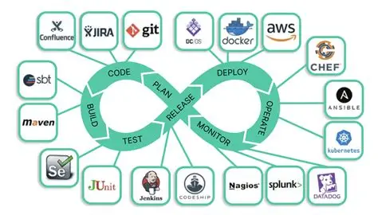
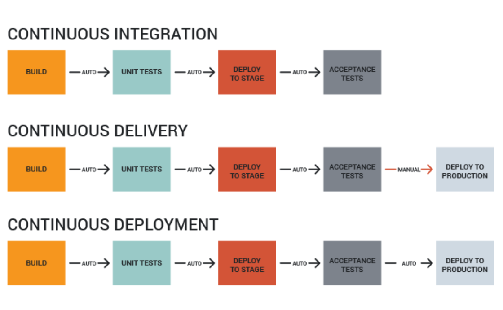
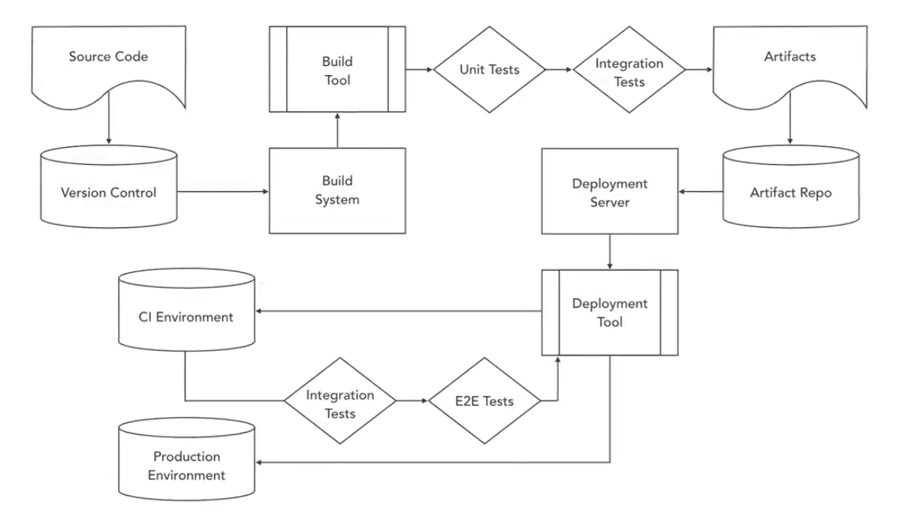

<h1 align='center'>Devops Foundation:   CI/CD</h1>

  

---
  

<h1 align="center">☁️⚙️ Chapter 1. Continuous Integration and Continuous Delivery 🏗️☁️</h1>
 

## 📌 Why CI/CD Exists (The Problem It Solves)

Most organizations struggle with:
- Painful, stressful release days 😰
- Buggy and unstable deployments
- Long release cycles (weeks or months)
- Fear of touching production code

**CI/CD exists to kill this chaos.**  
It replaces fear with automation, predictability, and speed.

  

 

## 🧠 Core CI/CD Concepts (At a Glance)

| Term | Meaning | Goal |
|-----|-------|------|
| **Continuous Integration (CI)** | Automatically build & test code on every commit | Catch bugs early |
| **Continuous Delivery (CD)** | Automatically deploy to production-like environments | Always be release-ready |
| **Continuous Deployment** | Automatically deploy to production | Zero manual gates |

  

## 🔁 Continuous Integration (CI)

### 📖 Definition
Continuous Integration is the practice of **frequently merging code** into a shared repository and **automatically building and unit testing** it.

### 🧩 Key Characteristics

| Aspect | CI Practice |
|-----|------------|
| Code commits | Frequent, small changes |
| Branching | Short-lived branches |
| Testing | Automated unit tests |
| Feedback | Fast (minutes, not days) |

### 💡 Important Reality
- Developers should **build & test locally** before pushing
- Long-running branches = merge hell 🔥
- CI shortens the feedback loop for *every change*

 

## 🚚 Continuous Delivery (CD)

### 📖 Definition
Continuous Delivery extends CI by **deploying every successful build to a production-like environment** and running **automated integration & acceptance tests**.

### 🧩 What Gets Added in CD

| CI | ➕ | CD |
|---|---|---|
| Build | → | Deploy |
| Unit tests | → | Integration tests |
| Local validation | → | Production-like validation |

### 🧪 Environments Used
- Docker containers
- Virtual machines
- Mock services
- Staging / QA environments

👉 **Key rule:**  
Testing should *end* with a deployment.

 

## 🚀 Continuous Deployment (Next Level)

### 📖 Definition
Every change that passes **all automated tests** is **automatically deployed to production**.

### 😱 Sounds Scary?
Yes.  
But companies like:
- Facebook
- Etsy
- Wealthfront

do this **daily at massive scale**.

### 🔐 Why It Works
- Small changes
- Strong test coverage
- No manual bottlenecks

  

## ⚖️ CI vs CD vs Continuous Deployment

| Feature | CI | CD | Continuous Deployment |
|-----|----|----|----------------|
| Automated builds | ✅ | ✅ | ✅ |
| Automated tests | Unit | Unit + Integration | Full test suite |
| Auto deploy | ❌ | To staging | To production |
| Manual approval | Yes | Optional | ❌ |

  

  

# 🌟 Benefits of Continuous Delivery

## 🧠 1. Empowered Teams (Cultural Shift)

| Before CD | After CD |
|---------|----------|
| Manual handoffs | Self-service pipelines |
| Blame between teams | Shared ownership |
| Reactive firefighting | Predictable workflow |

👉 Teams trust the pipeline, not heroics.

 

## ⏱️ 2. Drastically Reduced Cycle Time

| Organization Type | Release Time |
|------------------|-------------|
| Low performers | 1 week – 1 month |
| CD teams | Minutes – Hours |

 

## 🔐 3. Better Security (Yes, Faster = Safer)

| Metric | High Performers |
|------|----------------|
| Security remediation time | ⬇️ 50% |
| Compliance audits | Easier & repeatable |

Security becomes **continuous**, not last-minute panic.

 

## 😌 4. Stress-Free Releases

| Traditional Releases | CD Releases |
|---------------------|-------------|
| Big meetings | Normal workflow |
| Untested steps | Practiced every commit |
| High stress | Just another Tuesday |

👉 You’re *always practicing deployment*.

 

## 💰 5. More Business Value

| Impact | Result |
|-----|------|
| Less rework | More feature development |
| Fewer integration issues | Faster innovation |
| Time saved | ~29% more features |

Managers love it. Developers love it. Users love it.

 

## 🧱 CI/CD Pipeline (High Level)

| Stage | Purpose |
|-----|--------|
| Source Control | Track changes |
| Build | Compile / package |
| Test | Validate correctness |
| Artifact Management | Store builds |
| Deploy | Release safely |

  

---
---
  