# Jenkins — Beginner Friendly Introduction 🚀

<p align="center">
  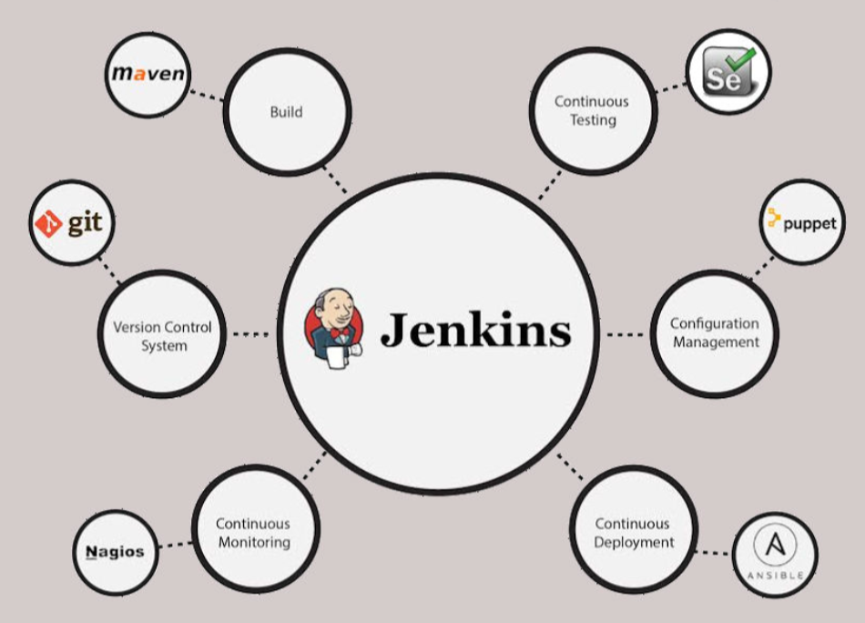
</p>

## What is Jenkins?

Jenkins is an **open-source automation server** used to **build, test, and deploy** applications automatically. It mainly helps teams implement **CI/CD (Continuous Integration & Continuous Delivery)** without manual effort.

- Jenkins is free, open-source, and easy to use, with a massive plugin ecosystem.
- It scales from student laptops to enterprise servers, adapting to almost any workflow.

<br>

## Key Jenkins Terms (Must-Know)

These words will come up **again and again**.

| Term              | Simple Meaning                                                |
| ----------------- | ------------------------------------------------------------- |
| **Job / Project** | A set of instructions Jenkins follows (same thing).           |
| **Build**         | Running a job (noun + verb).                                  |
| **Build Step**    | One action inside a job (e.g., run script, pull code).        |
| **Trigger**       | Event that starts a build (manual, schedule, webhook).        |
| **Plugin**        | Adds extra features to Jenkins (most power comes from these). |

📌 Reality check: Jenkins without plugins is basic. **Plugins are the real power.**

---
---
<br><br>

## System Requirements
Jenkins runs on Windows, macOS, and Linux with 256 MB RAM, 1 GB storage, and Java 21. <br>
📌 If using **Docker**, just install **Docker Desktop** (Java is already included).


---
---
<br><br>


<h1 align='center'> Install Jenkins Using Docker 🐳</h1>

```
You need admin access, 4 GB+ RAM, 10 GB disk, and basic Docker awareness (optional but helpful).
```

### Step 1: Install Docker Desktop

Docker Desktop provides the runtime + CLI needed to run Jenkins containers.
- [Docker Desktop setup](https://docs.docker.com/desktop/)

After installation, **start Docker Desktop** and wait until it shows:

> 🟢 Docker Desktop is running
<p align="center"> 
  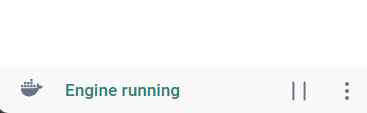 
</p>
---

### Step 2: Verify Docker Installation

Open a **new terminal** and run:

```bash
docker --version
docker run hello-world
```

✅ If you see *"Hello from Docker"*, Docker is working correctly.
<p align="center"> 
  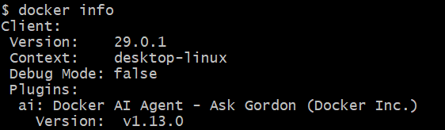  <br>
  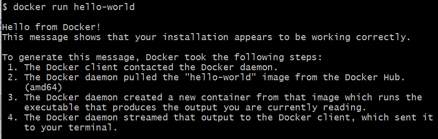
</p>
---

### Step 3: Pull Jenkins Image (LTS + Java 21)

This image already includes Jenkins + Java.

```bash
docker pull jenkins/jenkins:lts-jdk21
```

<p align="center"> 
  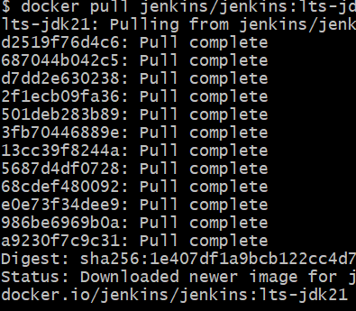  
</p>
---

### Step 4: Create a Volume for Jenkins Data

This prevents data loss when the container stops.

```bash
docker volume create jenkins_volume
```

<p align="center"> 
  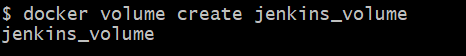  
</p>

📌 Without a volume → jobs, users, and configs will be lost.

---

### Step 5: Run Jenkins Container

Start Jenkins in detached mode on port **8080**.

```bash
docker run --detach \
  --volume jenkins_volume:/var/jenkins_home \
  --publish 8080:8080 \
  --name jenkins \
  jenkins/jenkins:lts-jdk21
```

<p align="center"> 
  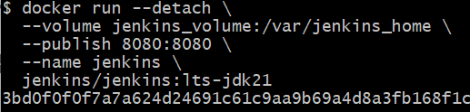  
</p>


#### What this command does 

| Option                | Purpose                      |
| --------------------- | ---------------------------- |
| `--detach`            | Runs container in background |
| `--volume`            | Persists Jenkins data        |
| `--publish 8080:8080` | Exposes Jenkins web UI       |
| `--name jenkins`      | Easy container reference     |

---

### Step 6: Get Initial Admin Password

Jenkins generates a one-time password on first startup. **(run command in powershell if using windows.)**

```powershell
docker exec jenkins cat /var/jenkins_home/secrets/initialAdminPassword
```

📋 Copy this password — you’ll need it in the browser. 

---

### Step 7: Finish Setup in Browser

Open your browser and go to:

👉 **[http://localhost:8080](http://localhost:8080)**

<p align="center"> 
  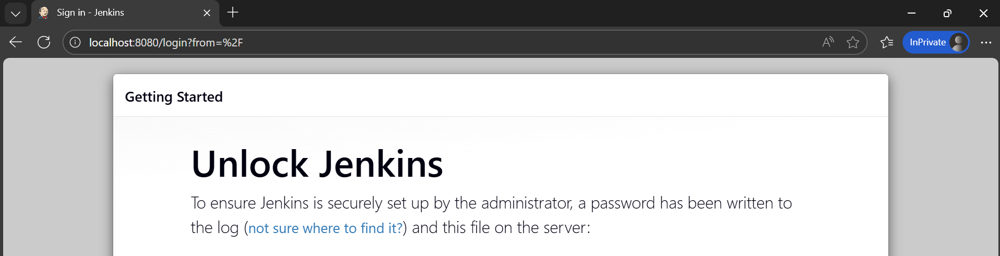  
</p>

* Paste the admin password
* Install suggested plugins
* Create your admin user

🎉 Jenkins is now running inside Docker!

---
<br>


## Finish Jenkins Installation 

### Step 1: Unlock Jenkins

After opening Jenkins at **[http://localhost:8080](http://localhost:8080)**, you must unlock it.

```bash
docker exec jenkins cat /var/jenkins_home/secrets/initialAdminPassword
```

* Copy the password
* Paste it into the Jenkins unlock screen

<br>

### Step 2: Install Suggested Plugins

* Choose **Install suggested plugins**
* Wait 1–2 minutes for installation to finish

These plugins cover most common Jenkins use cases.

<p align="center"> 
  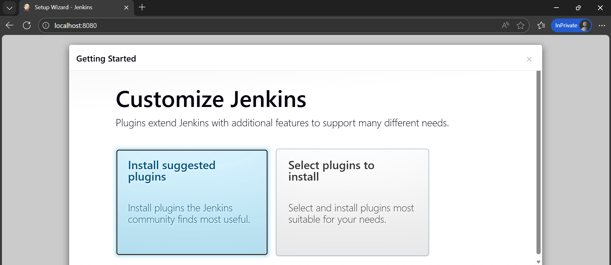  
</p>

<br>

### Step 3: Create Admin User

* Enter **username & password**
* Add **name and email** (can be dummy, but valid format)
* Click **Save and Continue**


<p align="center"> 
  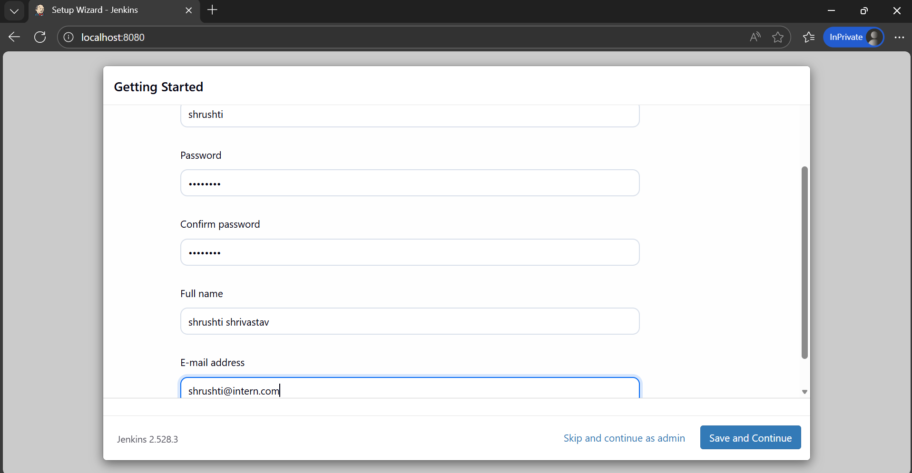 
</p>

<br>

### Step 4: Instance Configuration

* Accept the default Jenkins URL
* Click **Save and Finish**

<p align="center"> 
  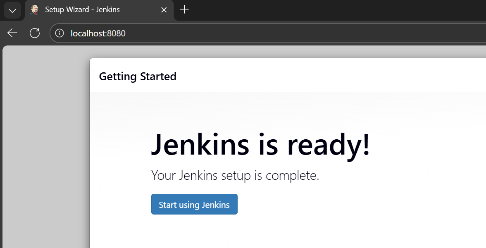 
</p>

🎉 Jenkins setup is complete.

<br>

## Jenkins User Interface (What Matters)

| Menu                      | Purpose                 |
| ------------------------- | ----------------------- |
| **New Item**              | Create jobs (most used) |
| **Manage Jenkins**        | System configuration    |
| **Build Queue**           | Jobs waiting to run     |
| **Build Executor Status** | Jobs currently running  |

📌 You may see a security warning about controller builds — safe to ignore for learning.

<p align="center"> 
  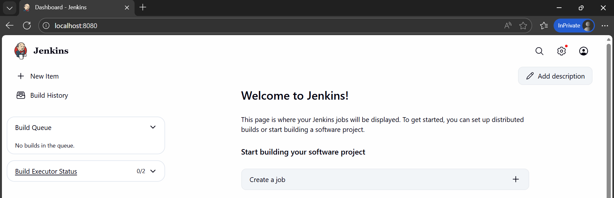 
</p>

<br>

## Manage Plugins (Basics)

Path: **Manage Jenkins → Plugins**

<p align="center"> 
  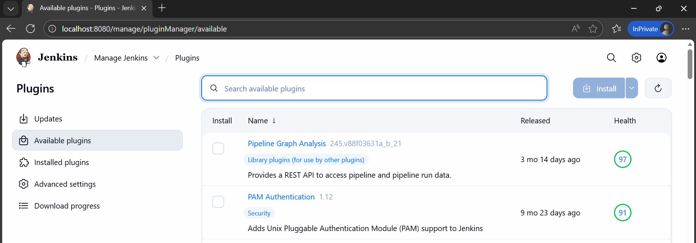 
</p>

| Action    | What It Does                       |
| --------- | ---------------------------------- |
| Available | Install new plugins                |
| Installed | View / disable / uninstall plugins |
| Disable   | Temporarily turn off a plugin      |
| Uninstall | Completely remove a plugin         |

🔁 After uninstalling a plugin, restart Jenkins:

```
http://localhost:8080/safeRestart
```

<br>

## Manage Tools (Basics)

Path: **Manage Jenkins → Tools**

Used to configure tools Jenkins jobs depend on.

| Tool  | Example Use              |
| ----- | ------------------------ |
| Java  | Build Java apps          |
| Maven | Build & package projects |
| Git   | Source code checkout     |

### Example: Add Maven

* Click **Add Maven**
* Name it (e.g., `Maven-3.9.9`)
* Enable **automatic installation**
* Click **Save**

📌 Jenkins installs the tool automatically when a job needs it.

---
---
<br><br>


<h1 align='center'>Chapter 2: Jenkins Job</h1>

# Your First Jenkins Job (Hello Jenkins)

Just like *Hello World* in programming, this job confirms Jenkins is working correctly.

### Steps to Create the Job

1. From Jenkins Dashboard → click **New Item**
2. Enter job name: `Hello-Jenkins`
   📌 Avoid spaces in job names (CLI & API friendly)
3. Select **Freestyle Project** → Click **OK**

---

### Configure the Job

Scroll to **Build** section → **Add Build Step**

| System                 | Build Step                    |
| ---------------------- | ----------------------------- |
| Windows                | Execute Windows batch command |
| Linux / macOS / Docker | Execute Shell                 |

Command to add:

```bash
echo "Hello, Jenkins"
```

Click **Apply** → **Save**

---

### Run the Job

* Click **Build Now**
* Under **Build History**:

  * 🟢 Green check → Success
  * 🔴 Red X → Failure

Click the build number or check mark to view **Console Output**.

---

## Jenkins Job Types (Overview)

| Job Type                 | Purpose                          |
| ------------------------ | -------------------------------- |
| **Freestyle**            | Most common, flexible jobs       |
| **Pipeline**             | CI/CD as code (Jenkinsfile)      |
| **Multi-configuration**  | Same job, multiple parameters    |
| **Multibranch Pipeline** | Different branches, same repo    |
| **Organization Folder**  | Auto-detect repos                |
| **Folder**               | Organize jobs (not a job itself) |

📌 Course focus: **Freestyle jobs**

---

## Job Configuration Sections (What Matters)

### General

| Option             | Purpose                    |
| ------------------ | -------------------------- |
| Description        | Explains what the job does |
| Discard Old Builds | Prevents disk from filling |

---

### Source Code Management (SCM)

Used to pull code from repositories.

| Feature     | Use                   |
| ----------- | --------------------- |
| Git URL     | Repo location         |
| Credentials | Secure repo access    |
| Branch      | Code version to build |

Works with GitHub, GitLab, Bitbucket.

---

### Build Triggers (How Jobs Start)

| Trigger                | Use Case                         |
| ---------------------- | -------------------------------- |
| Manual                 | Click **Build Now**              |
| Build After Other Jobs | Job dependencies                 |
| Build Periodically     | Scheduled (cron)                 |
| GitHub Webhook         | CI on code changes               |
| Poll SCM               | Not recommended (resource heavy) |

📌 Webhooks are preferred over polling.

---

### Build Environment

| Option           | Why It’s Useful         |
| ---------------- | ----------------------- |
| Delete Workspace | Clean build every run   |
| Inject Secrets   | Secure passwords & keys |
| Timeout          | Stop stuck jobs         |

---

### Build Steps (What Jenkins Executes)

| Type           | Example          |
| -------------- | ---------------- |
| Execute Shell  | Bash scripts     |
| Execute Batch  | Windows commands |
| Maven / Gradle | Java builds      |

✔ Multiple build steps allowed
✔ Steps can be reordered

---

### Post-Build Actions

Actions after job finishes.

| Action             | Purpose           |
| ------------------ | ----------------- |
| Archive Artifacts  | Save build output |
| Trigger Job        | Chain jobs        |
| Email Notification | Notify users      |

---

## Run & Monitor Jobs

### Build Status Indicators

| Icon           | Meaning   |
| -------------- | --------- |
| 🟢 Green Check | Success   |
| 🔴 Red X       | Failure   |
| 🔵 Blue Circle | First run |
| 🔄 Spinning    | Running   |

Each run gets a unique **Build ID**.

---

## Console Output (Logs)

* Click build number → **Console Output**
* Shows:

  * Commands executed
  * Output logs
  * Errors (if any)

📌 Console updates **live** while job runs.

---

## Simulating a Failed Build

Linux / macOS / Docker:

```bash
exit 1
```

Windows (Batch):

```bat
exit /B 1
```

Any non-zero exit code → **Build Failure**

---

## Monitor Build Trends

* Expand **Build History**
* View:

  * Success vs Failure timeline
  * Build duration trends

Useful for identifying slow or unstable jobs.

---
---
<br><br>


<h1 align='center'>Chapter 3: Job Workspaces,Artifacts and Parameters.</h1>

# Using a Global Build Tool

Jenkins allows you to configure tools **once** and reuse them across multiple jobs. This ensures consistency and avoids repeating setup for every project.

### Tools Used in This Chapter

| Tool  | Purpose                             |
| ----- | ----------------------------------- |
| Git   | Fetch source code from repositories |
| Maven | Build and package Java applications |

### High-Level Flow

1. Configure **Git** and **Maven** in **Manage Jenkins → Tools**
2. Create a job and connect it to a Git repository
3. Use Maven to build the project
4. Run the compiled Java application

### Job Configuration Steps

* **Source Code Management** → Select **Git**
* Paste the **repository HTTPS URL**
* Update branch from `master` → `main` (common GitHub default)
* If repo is private, add credentials

### Build Steps

1. **Invoke top-level Maven targets**

   * Select configured Maven version (e.g., `maven-3.9.9`)
   * Goals: `package`

2. **Run Java Application**

   * macOS / Linux / Docker → `Execute Shell`
   * Windows → `Execute Windows Batch Command`

### Output Verification

* Git checkout confirmation
* Maven build and dependency download logs
* Final output (example): `Hello, world!`

<br>

# Job Workspace

Each Jenkins job gets a dedicated **workspace** on the server.

### What the Workspace Contains

* Source code checked out from Git
* Build outputs (JARs, logs, reports)
* Temporary files used during the build

### Workspace Actions

| Action             | Description                 |
| ------------------ | --------------------------- |
| Browse Workspace   | View files and folders      |
| Wipe Out Workspace | Deletes all workspace files |

⚠️ No undo for workspace deletion — next build recreates it.

### Automatic Cleanup Options

* **Before build**: Environment → *Delete workspace before build starts*
* **After build**: Post-build action → *Delete workspace when job is done*

<br>

# Managing Artifacts

Artifacts are **outputs produced by a build**.

### Common Artifact Examples

* JAR / WAR files
* Executables
* Reports and logs

### Archiving Artifacts

1. Go to **Post-Build Actions**
2. Select **Archive the artifacts**
3. Provide file path (relative to workspace)

#### Tips

* Jenkins suggests correct paths if entered incorrectly
* Use wildcards to simplify paths:

```
**/*.jar
```

### Result

* Artifacts get a **direct download link**
* Persist across builds

<br>

# Parameters and Environment Variables

Parameterized jobs make Jenkins builds **reusable and flexible**.

### Key Concepts

* Parameters become **environment variables**
* Typically written in **UPPERCASE**
* Case-sensitive on Linux/macOS/Docker

### Accessing Variables

| Platform               | Syntax       |
| ---------------------- | ------------ |
| Windows                | `%VAR_NAME%` |
| Linux / macOS / Docker | `$VAR_NAME`  |

### Useful Built-in Variables

| Variable     | Purpose                  |
| ------------ | ------------------------ |
| BUILD_ID     | Unique build identifier  |
| BUILD_NUMBER | Incremental build number |

<br>

## String Parameters

Used for free-text input like versions.

### Example

* Name: `VERSION`
* Default: `1.0.0`
* Description: Version number for build

### Result

* Job shows **Build with Parameters**
* Input value is available during execution

<br>

## Choice Parameters

Used to restrict input to predefined values.

### Example

* Name: `ENVIRONMENT`
* Choices:

  * development
  * staging
  * production

### Benefit

Prevents invalid inputs and enforces consistency.

<br>

## Boolean Parameters

Used for on/off decisions.

### Example

* Name: `RUN_TESTS`
* Checkbox input
* Default: unchecked (`false`)

### Usage

Scripts can conditionally execute steps based on parameter value.

<br>

## Scheduling Jobs (Cron)

Jenkins can run jobs automatically using **Cron-style schedules**.

### Cron Fields Order

```
MINUTE HOUR DAY MONTH DAY_OF_WEEK
```

### Common Examples

| Schedule    | Meaning               |
| ----------- | --------------------- |
| `0 0 * * *` | Every day at midnight |
| `H * * * *` | Once every hour       |
| `@daily`    | Once per day          |
| `@midnight` | Overnight (12–3 AM)   |

# Jenkins Enhancement: `H`

* Spreads job execution to reduce server load
* Prevents multiple jobs from running at the same second

### Time Zone Awareness

* Schedules follow **server time zone**
* Can specify explicitly:

```
TZ=Europe/London
```

### Verification

* Jenkins shows last and next run time
* Build log states: *Started by timer*

<br>

```
Key Takeaways

- Global tools simplify job configuration
- Workspaces isolate job files
- Artifacts preserve important outputs
- Parameters make jobs reusable
- Scheduling enables automation
```

---
---
<br><br>


<h1 align='center'>Chapter 4: Organize Jobs with Views and Folders.</h1>

# Why Views and Folders Matter

As Jenkins grows, job sprawl becomes real. In large teams (for example, multiple apps per team), you can easily end up with **hundreds of jobs**. Views and folders exist to keep Jenkins **usable, searchable, and sane**.

* **Views** → Logical filters to *see* jobs
* **Folders** → Physical-like structure to *store* jobs

<br>

## Views in Jenkins

### What is a View?

A **View** is a filtered dashboard that displays jobs based on rules you define.

Think of it as:

> “Show me only the jobs I care about right now.”

Key points:

* Views do **not** move jobs
* A job can appear in **multiple views**
* The default **All** tab is itself a view

<br>

### Create a View (List View)

**Steps:**

1. On Jenkins dashboard, click **➕ (plus)** next to the *All* tab
2. Enter a **View Name** (example: `Build`)
3. Select **List View** → **Create**
4. (Optional) Add a description

<br>

### Filter Jobs Using Regular Expressions

Instead of manually selecting jobs, use **regex**.

Example:

```text
.*BUILD.*
```

Meaning:

* `.*` → match any characters
* `BUILD` → job name contains "build"

✔ Automatically includes **existing and future jobs** with `build` in their name.

Repeat the same for:

* `TEST` → `.*TEST.*`
* `DEPLOY` → `.*DEPLOY.*`

<br>

### Recursive Views (Important)

By default, views only show jobs at the **same level**.

If jobs are inside folders:

1. Edit the view
2. Enable **Recurse in subfolders**

✔ Now the view displays jobs across all folders.

<br>

## Folders in Jenkins

### What is a Folder?

A **Folder** is a container that organizes jobs like directories in a file system.

Folders can contain:

* Jobs
* Views
* Other folders

Each folder has its **own namespace**, meaning:

* Jobs inside folders can share names
* Isolation improves clarity and access control

<br>

### Create a Folder

**Steps:**

1. From Jenkins dashboard → **New Item**
2. Enter folder name (example: `Cyclones`)
3. Select **Folder** → **OK**
4. Add a description
5. Click **Save**

<br>

### Move Jobs into a Folder

1. Open job menu (dropdown)
2. Select **Move**
3. Choose destination folder
4. Confirm

⚠ Jobs must be moved **one at a time** (no drag-and-drop).

<br>

### Views + Folders = Best Practice

The most scalable setup:

* **Folders** → Organize by team/project
* **Views** → Filter by job type (Build/Test/Deploy)

✔ Clean dashboard
✔ Faster navigation
✔ Enterprise-ready structure

<br>

## Search with Command Palette

The **Command Palette** provides instant navigation.

### Shortcut

* **macOS** → `Cmd + K`
* **Windows/Linux** → `Ctrl + K`

### What You Can Search

* Jobs
* Folders
* Views
* Users
* Builds

Examples:

* `Cyclones` → shows folder + jobs
* `build` → jobs + views containing "build"
* `Cyclones deploy 1` → first deploy build

✔ Selecting a result jumps directly to it.

<br>

## Deleting Views and Folders (Very Important)

### Deleting a View

* Removes only the **view**
* Jobs inside the view are **NOT deleted**

Safe operation ✔

<br>

### Deleting a Folder

* Deletes the folder
* **Deletes ALL contents inside it**

  * Jobs
  * Views
  * Subfolders

🚨 **Permanent and destructive**

> Always double-check before deleting folders.

---
---
<br>


# Conclusion: Pipeline as Code

So far, jobs were configured manually (freestyle jobs). Jenkins also supports **Pipeline as Code**.

### Jenkins Pipeline

* Defined in a `Jenkinsfile`
* Stored in source control (Git)
* Fully versioned and auditable

---

### Pipeline Structure

| Component | Purpose                              |
| --------- | ------------------------------------ |
| Pipeline  | Entire job definition                |
| Stages    | Logical phases (Build, Test, Deploy) |
| Steps     | Commands inside each stage           |

---

### Benefits of Pipelines

* Configuration as code
* Easier maintenance
* Visual stage tracking
* Better debugging
* Industry standard for CI/CD

---

## Build Agents and Cloud Runners

### What is a Build Agent?

A **build agent** is a separate machine that Jenkins uses to run jobs.

Benefits:

* Parallel execution
* OS-specific builds
* Tool isolation

---

### Cloud-Based Agents

Jenkins can dynamically create agents using cloud providers:

* AWS
* Azure
* Google Cloud

Using plugins:

* Agents spin up **on demand**
* Jobs run
* Agents are destroyed

✔ Faster builds
✔ Lower cloud cost
✔ Massive scalability

---

```
Chapter Summary

- Views filter jobs for better visibility
- Folders organize jobs structurally
- Regex makes views dynamic
- Command palette speeds navigation
- Deleting folders is destructive
- Pipelines bring jobs-as-code
- Build agents enable Jenkins to scale
```


---
---
<br><br>
<h1 align='center'>Deletion</h1>
- Jenkins runs in a Docker container.
- Deleting the container removes Jenkins temporarily, but deleting the container + volume removes everything (jobs, users, configs).

# commands for deletion

## Delete only Jenkins container (data stays)
docker rm -f jenkins

## Delete Jenkins container + all data (clean wipe)
docker rm -f jenkins
docker volume rm jenkins_volume

## (Optional) Remove Jenkins image
docker rmi jenkins/jenkins:lts-jdk21

---
---
<br><br>


---
<br><br>

[Click here to redirect to INDEX](../README.md) 