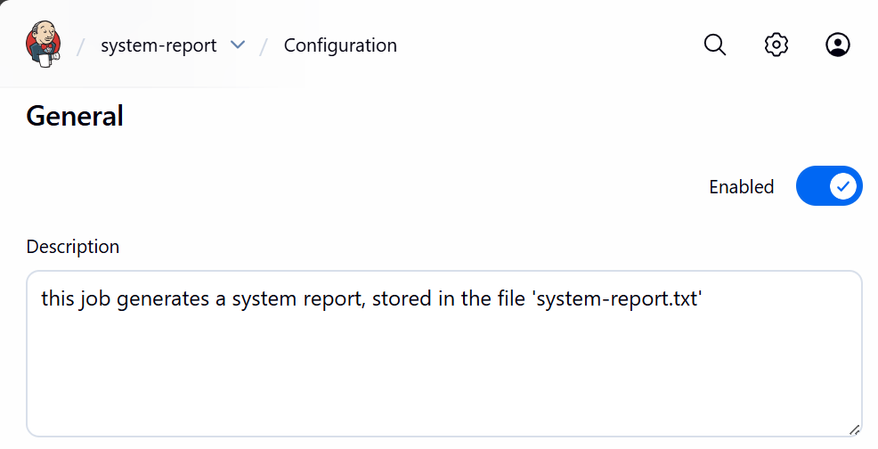
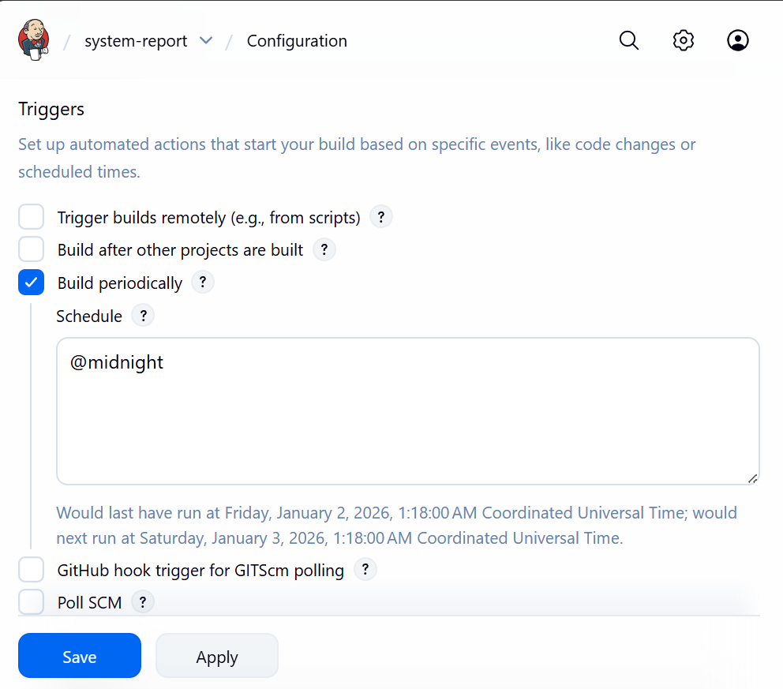
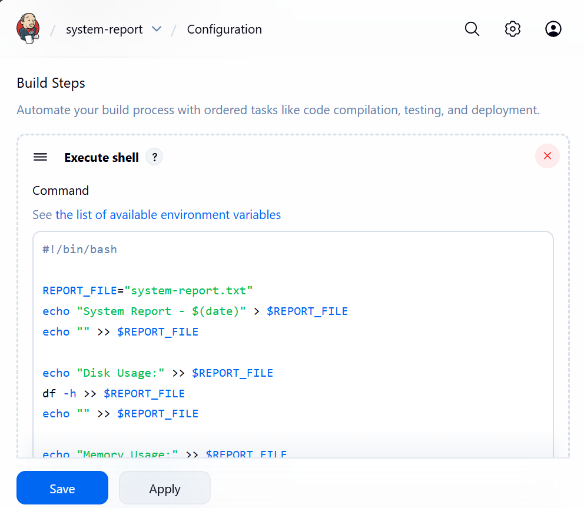
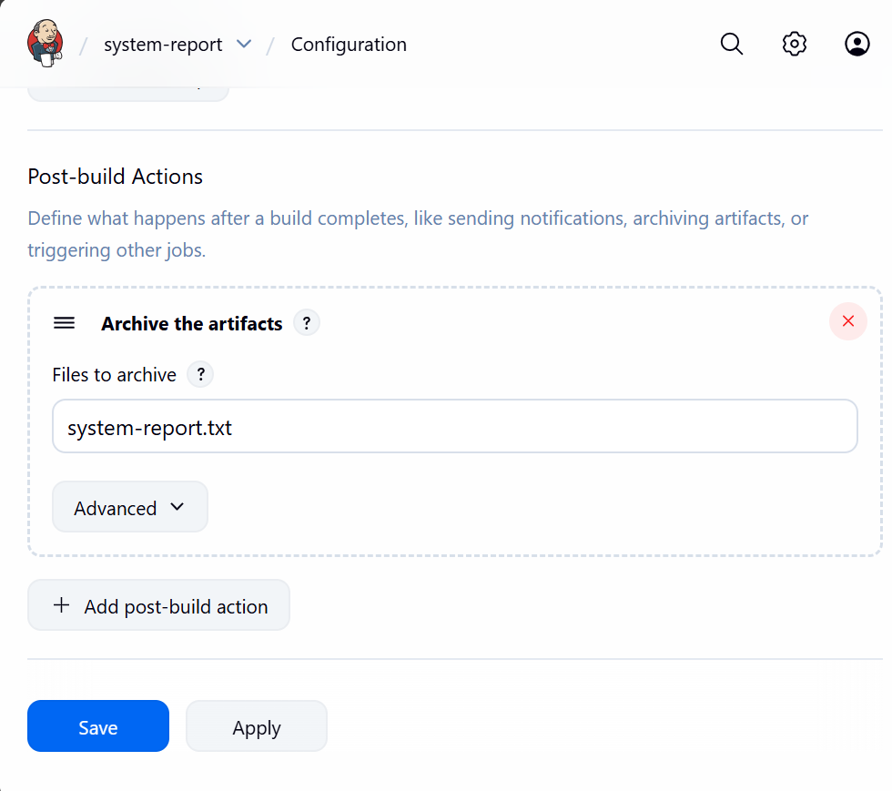
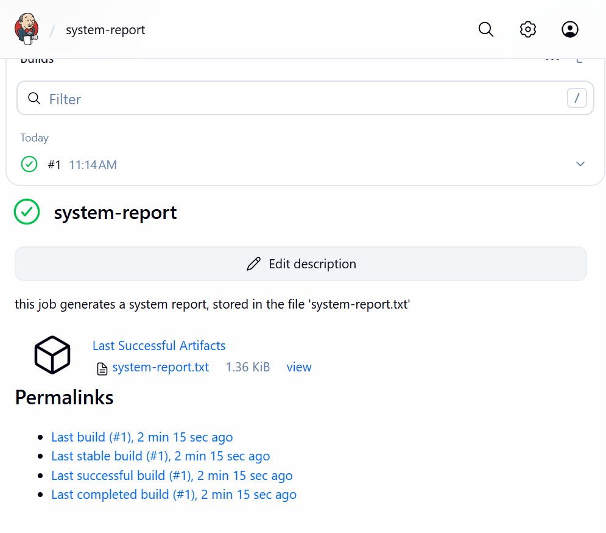
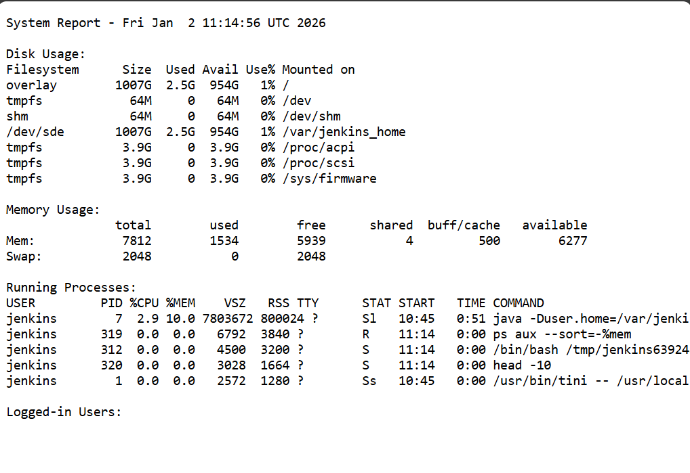

# Automate System Monitoring with Jenkins

## Objective
Create a Jenkins freestyle job that generates a daily system report from the machine where Jenkins is running and archives the report.

---

## Job Configuration
- **Job Name:** system-report  
- **Job Type:** Freestyle Project  
- **Report File:** system-report.txt  
- **Schedule:** Once per day  

---

## Step 1: Create the Job
1. Open Jenkins Dashboard
2. Click **New Item**
3. Enter name: `system-report`
4. Select **Freestyle project**
5. Click **OK**
<p align="center"> 
   
</p>

---

## Step 2: Configure Build Trigger
Schedule the job to run once a day. Options include the following, among others:
- 0 0 * * *
- H H * * *
- @daily
- @midnight
<p align="center"> 
   
</p>

---

## Step 3: Add Build Step

### For macOS / Linux / Docker

Add **Execute shell**:

```bash
#!/bin/bash

REPORT_FILE="system-report.txt"

echo "System Report - $(date)" > $REPORT_FILE
echo "" >> $REPORT_FILE

echo "Disk Usage:" >> $REPORT_FILE
df -h >> $REPORT_FILE
echo "" >> $REPORT_FILE

echo "Memory Usage:" >> $REPORT_FILE
free -m >> $REPORT_FILE
echo "" >> $REPORT_FILE

echo "Running Processes:" >> $REPORT_FILE
ps aux --sort=-%mem | head -10 >> $REPORT_FILE
echo "" >> $REPORT_FILE

echo "Logged-in Users:" >> $REPORT_FILE
who >> $REPORT_FILE
```

<p align="center"> 
   
</p>

---

### For Windows

Add **Execute Windows batch command**:

```bat
@echo off

set REPORT_FILE=system-report.txt

echo System Report - %DATE% %TIME% > %REPORT_FILE%
echo. >> %REPORT_FILE%

echo Disk Usage: >> %REPORT_FILE%
wmic logicaldisk get caption,freespace,size >> %REPORT_FILE%
echo. >> %REPORT_FILE%

echo Memory Status: >> %REPORT_FILE%
systeminfo | findstr /C:"Total Physical Memory" /C:"Available Physical Memory" >> %REPORT_FILE%
echo. >> %REPORT_FILE%

echo Running Processes: >> %REPORT_FILE%
tasklist >> %REPORT_FILE%
echo. >> %REPORT_FILE%

echo Logged-in Users: >> %REPORT_FILE%
query user >> %REPORT_FILE%
```

---

## Step 4: Archive Artifacts

1. Go to **Post-build Actions**
2. Select **Archive the artifacts**
3. Enter:

```text
system-report.txt
```

<p align="center"> 
   
</p>

---

## Step 5: Verification

1. Click **Build Now**
2. Confirm build status is **SUCCESS**
3. Open **Console Output** to verify execution
4. Download `system-report.txt` from **Artifacts**

<p align="center"> 
    <br><br>
  
</p>

---

## Result

The Jenkins job runs daily, collects system information, and archives the report for future reference.


[Return to course](devops_foundation_jenkins.md)